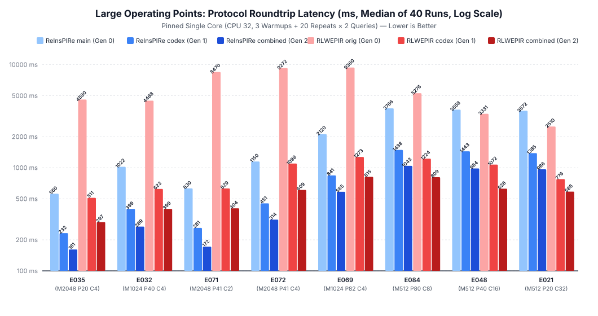
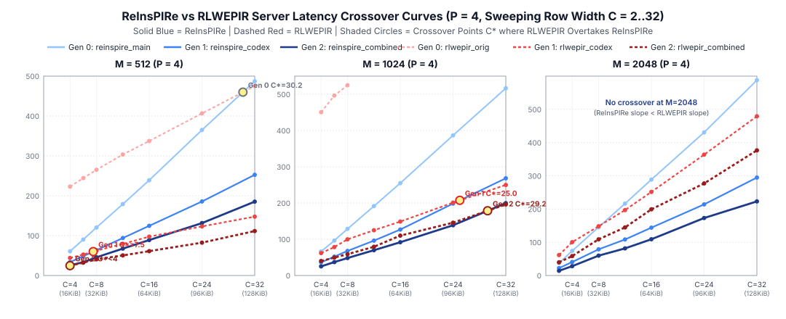

# ReInsPIRe Benchmark Results & 3-Way Comparison (Gen 0 vs Gen 1 vs Gen 2)

Complete experimental evaluation of **Gen 0** (`main`, commit `d1fb2ab`), **Gen 1** (`codex/reinspire`, commit `cce9337`: `I5, I3a, I3b, I4`), and **Gen 2** (`combined`: `I1, I2, I3, I4`), plus cross-protocol comparisons against RLWEPIR across **30 operating points** (`180` benchmark suites, `7,200` measured queries total). See [`improvements.md`](./improvements.md) for the 3-class optimization taxonomy and [`audit.md`](./audit.md) for the correctness, noise, and security audit.

## 1. Methodology

- **Hardware & Isolation**: Single pinned CPU core (`PIR_ONLINE_CPU=32`, `PIR_ONLINE_THREADS=1`) on an AMD EPYC 7B13 (Zen 3), built with `-c opt -march=znver2`. Offline setup runs on `taskset -c 32-39` (`PIR_PREPROCESS_THREADS=8`).
- **Statistical Rigor**: `3` warmup iterations + `20` measured repeats over $Q = 2$ query routes = **`40` measured queries per operating point**. All tables report **`Median (IQR)` and `Mean ± 95% CI`**.

---

## 2. ReInsPIRe 3-Way Headline Progression (`main` → `codex` → `combined`)

| Workload | Offline Setup (s) | Server Online (ms) | Client Query + Decode (ms) | Protocol Roundtrip (ms) | Upload / Download (B) | Correct |
|---|---:|---:|---:|---:|---:|---|
| `dev_M512_P4_C8` | 24.1 → 23.7 → **10.1** (2.35×) | 120.35 → 63.67 → **45.61** (2.64× vs Gen0, 1.40× vs Gen1) | 74.46 → 10.02 → **4.53** (16.43× vs Gen0, 2.21× vs Gen1) | 194.97 → 73.71 → **50.19** (3.88× vs Gen0, 1.47× vs Gen1) | 66584/385216 = | ✓ 40/40 |
| `dev_M1024_P4_C4` | 12.3 → 12.0 → **5.3** (2.25×) | 66.00 → 36.40 → **25.26** (2.61× vs Gen0, 1.44× vs Gen1) | 47.84 → 7.10 → **3.74** (12.79× vs Gen0, 1.90× vs Gen1) | 114.02 → 43.47 → **28.97** (3.94× vs Gen0, 1.50× vs Gen1) | 79896/192608 = | ✓ 40/40 |
| `dev_M2048_P4_C2` | 6.4 → 6.2 → **2.7** (2.27×) | 37.59 → 22.24 → **14.08** (2.67× vs Gen0, 1.58× vs Gen1) | 33.93 → 5.67 → **3.39** (10.00× vs Gen0, 1.67× vs Gen1) | 71.56 → 27.94 → **17.47** (4.10× vs Gen0, 1.60× vs Gen1) | 106520/96304 = | ✓ 40/40 |
| `dev_M2048_P4_C4` | 12.5 → 12.2 → **5.4** (2.24×) | 73.91 → 40.67 → **28.20** (2.62× vs Gen0, 1.44× vs Gen1) | 47.73 → 7.20 → **3.88** (12.30× vs Gen0, 1.85× vs Gen1) | 121.70 → 47.86 → **32.11** (3.79× vs Gen0, 1.49× vs Gen1) | 106520/192608 = | ✓ 40/40 |
| `dev_M2048_P16_C4` | 25.7 → 25.0 → **11.5** (2.17×) | 293.48 → 163.65 → **118.39** (2.48× vs Gen0, 1.38× vs Gen1) | 159.22 → 22.42 → **10.31** (15.44× vs Gen0, 2.17× vs Gen1) | 452.78 → 186.13 → **128.69** (3.52× vs Gen0, 1.45× vs Gen1) | 266300/770432 = | ✓ 40/40 |
| `E035_M2048_P20_C4` | 37.7 → 36.4 → **16.6** (2.20×) | 365.91 → 204.65 → **148.56** (2.46× vs Gen0, 1.38× vs Gen1) | 194.13 → 27.39 → **12.50** (15.53× vs Gen0, 2.19× vs Gen1) | 559.67 → 232.15 → **161.12** (3.47× vs Gen0, 1.44× vs Gen1) | 319560/963040 = | ✓ 40/40 |
| `E032_M1024_P40_C4` | 61.6 → 59.8 → **27.9** (2.15×) | 644.00 → 347.94 → **245.00** (2.63× vs Gen0, 1.42× vs Gen1) | 377.89 → 50.76 → **23.54** (16.05× vs Gen0, 2.16× vs Gen1) | 1022.06 → 398.96 → **268.56** (3.81× vs Gen0, 1.49× vs Gen1) | 319620/1926080 = | ✓ 40/40 |
| `E071_M2048_P41_C2` | 38.0 → 36.9 → **16.3** (2.26×) | 381.20 → 222.83 → **151.36** (2.52× vs Gen0, 1.47× vs Gen1) | 248.68 → 37.92 → **19.96** (12.46× vs Gen0, 1.90× vs Gen1) | 629.96 → 260.90 → **171.77** (3.67× vs Gen0, 1.52× vs Gen1) | 599175/987116 = | ✓ 40/40 |
| `E072_M2048_P41_C4` | 75.2 → 73.7 → **32.5** (2.27×) | 752.66 → 397.73 → **289.85** (2.60× vs Gen0, 1.37× vs Gen1) | 395.37 → 53.71 → **24.21** (16.33× vs Gen0, 2.22× vs Gen1) | 1149.75 → 451.46 → **313.96** (3.66× vs Gen0, 1.44× vs Gen1) | 599175/1974232 = | ✓ 40/40 |
| `E069_M1024_P82_C4` | 137.5 → 132.3 → **59.5** (2.22×) | 1354.18 → 739.53 → **538.55** (2.51× vs Gen0, 1.37× vs Gen1) | 761.46 → 102.03 → **45.98** (16.56× vs Gen0, 2.22× vs Gen1) | 2119.53 → 841.44 → **584.56** (3.63× vs Gen0, 1.44× vs Gen1) | 599298/3948464 = | ✓ 40/40 |
| `E084_M512_P80_C8` | 250.7 → 243.9 → **110.5** (2.21×) | 2471.24 → 1327.93 → **983.03** (2.51× vs Gen0, 1.35× vs Gen1) | 1282.75 → 158.46 → **59.88** (21.42× vs Gen0, 2.65× vs Gen1) | 3766.40 → 1487.55 → **1043.28** (3.61× vs Gen0, 1.43× vs Gen1) | 319740/7704320 = | ✓ 40/40 |
| `E048_M512_P40_C16` | 247.4 → 238.8 → **105.4** (2.27×) | 2462.98 → 1301.61 → **940.02** (2.62× vs Gen0, 1.38× vs Gen1) | 1187.77 → 140.15 → **43.85** (27.09× vs Gen0, 3.20× vs Gen1) | 3657.55 → 1442.85 → **984.09** (3.72× vs Gen0, 1.47× vs Gen1) | 186500/7704320 = | ✓ 40/40 |
| `E021_M512_P20_C32` | 289.7 → 281.3 → **120.8** (2.33×) | 2445.90 → 1253.15 → **928.13** (2.64× vs Gen0, 1.35× vs Gen1) | 1128.28 → 131.48 → **37.62** (29.99× vs Gen0, 3.49× vs Gen1) | 3571.63 → 1384.91 → **965.71** (3.70× vs Gen0, 1.43× vs Gen1) | 119880/7704320 = | ✓ 40/40 |

---

## 3. ReInsPIRe 3-Way Detailed Phase Breakdown (`Med (IQR) / Mean±95%CI`, ms)

| Workload | Variant | Server Total (ms) | Unpack (ms) | InnerProd (ms) | PackMatrix (ms) | PackFinal (ms) | ModSwitch (ms) | Encode (ms) | Client Query (ms) | Client Decode (ms) | KeyGen / Sel / ReqPack (ms) | RespUnpack / Decrypt (ms) |
|---|---|---:|---:|---:|---:|---:|---:|---:|---:|---:|---:|---:|
| `dev_M512_P4_C8` | `main` | 120.35 (1.25) / 121.43±0.86 | 0.71 (0.01) / 0.71±0.00 | 8.47 (0.08) / 8.54±0.09 | 86.93 (0.93) / 87.78±0.79 | 21.17 (0.15) / 21.35±0.20 | 0.27 (0.00) / 0.27±0.00 | 2.34 (0.03) / 2.36±0.02 | 20.14 (0.21) / 20.23±0.23 | 54.25 (3.49) / 53.93±0.74 | 10.23 / 9.48 / 0.40 | 4.03 / 50.21 |
| `dev_M512_P4_C8` | `codex` | 63.67 (0.63) / 64.45±0.85 | 0.70 (0.00) / 0.71±0.00 | 6.47 (0.31) / 6.49±0.11 | 43.79 (0.51) / 44.48±0.62 | 9.39 (0.14) / 9.48±0.12 | 0.27 (0.00) / 0.27±0.00 | 2.34 (0.04) / 2.35±0.02 | 3.87 (0.05) / 3.87±0.01 | 6.15 (0.05) / 6.15±0.01 | 1.84 / 1.63 / 0.39 | 4.01 / 2.14 |
| `dev_M512_P4_C8` | **`combined`** | 45.61 (1.51) / 45.92±0.76 | 0.03 (0.00) / 0.04±0.00 | 5.69 (0.25) / 5.75±0.08 | 35.49 (1.33) / 35.90±0.66 | 3.72 (0.19) / 3.77±0.04 | 0.15 (0.01) / 0.15±0.00 | 0.24 (0.01) / 0.25±0.00 | 3.04 (0.09) / 3.07±0.03 | 1.47 (0.05) / 1.48±0.01 | 1.56 / 1.44 / 0.03 | 0.28 / 1.19 |
| `dev_M1024_P4_C4` | `main` | 66.00 (0.99) / 66.76±1.17 | 0.85 (0.01) / 0.86±0.00 | 8.44 (0.11) / 8.58±0.17 | 44.36 (0.69) / 44.88±0.89 | 10.65 (0.19) / 10.73±0.11 | 0.13 (0.01) / 0.14±0.00 | 1.19 (0.03) / 1.19±0.01 | 20.48 (0.28) / 20.48±0.07 | 27.48 (1.12) / 27.35±0.31 | 10.36 / 9.63 / 0.48 | 2.03 / 25.47 |
| `dev_M1024_P4_C4` | `codex` | 36.40 (1.19) / 36.59±0.25 | 0.85 (0.01) / 0.86±0.01 | 5.38 (0.34) / 5.38±0.07 | 22.88 (0.81) / 23.02±0.18 | 5.31 (0.09) / 5.35±0.05 | 0.13 (0.00) / 0.14±0.00 | 1.18 (0.02) / 1.19±0.01 | 3.98 (0.05) / 4.00±0.02 | 3.10 (0.06) / 3.11±0.02 | 1.86 / 1.64 / 0.47 | 2.02 / 1.08 |
| `dev_M1024_P4_C4` | **`combined`** | 25.26 (1.85) / 25.75±0.53 | 0.04 (0.00) / 0.04±0.00 | 4.89 (0.32) / 4.95±0.09 | 17.74 (1.34) / 18.13±0.43 | 2.36 (0.08) / 2.39±0.03 | 0.07 (0.00) / 0.07±0.00 | 0.12 (0.01) / 0.12±0.00 | 2.99 (0.04) / 3.00±0.01 | 0.73 (0.03) / 0.75±0.01 | 1.54 / 1.42 / 0.03 | 0.14 / 0.60 |
| `dev_M2048_P4_C2` | `main` | 37.59 (0.34) / 37.97±0.63 | 1.13 (0.01) / 1.14±0.01 | 8.34 (0.08) / 8.36±0.02 | 21.77 (0.16) / 22.13±0.63 | 5.31 (0.08) / 5.32±0.03 | 0.07 (0.00) / 0.07±0.00 | 0.59 (0.01) / 0.60±0.01 | 20.50 (0.39) / 20.53±0.08 | 13.50 (0.86) / 13.53±0.17 | 10.33 / 9.53 / 0.62 | 1.01 / 12.50 |
| `dev_M2048_P4_C2` | `codex` | 22.24 (0.28) / 22.30±0.12 | 1.14 (0.02) / 1.14±0.01 | 5.26 (0.06) / 5.28±0.03 | 11.19 (0.19) / 11.26±0.07 | 3.30 (0.06) / 3.32±0.02 | 0.07 (0.00) / 0.07±0.00 | 0.59 (0.02) / 0.59±0.00 | 4.12 (0.05) / 4.14±0.03 | 1.55 (0.02) / 1.57±0.02 | 1.86 / 1.63 / 0.62 | 1.00 / 0.54 |
| `dev_M2048_P4_C2` | **`combined`** | 14.08 (0.36) / 14.32±0.29 | 0.05 (0.00) / 0.05±0.00 | 4.13 (0.09) / 4.19±0.07 | 8.47 (0.33) / 8.63±0.20 | 1.31 (0.03) / 1.33±0.03 | 0.03 (0.00) / 0.03±0.00 | 0.06 (0.00) / 0.06±0.00 | 3.01 (0.04) / 3.03±0.02 | 0.37 (0.01) / 0.38±0.01 | 1.54 / 1.43 / 0.04 | 0.07 / 0.30 |
| `dev_M2048_P4_C4` | `main` | 73.91 (0.56) / 74.07±0.18 | 1.13 (0.01) / 1.13±0.00 | 16.98 (0.17) / 16.99±0.04 | 43.54 (0.30) / 43.68±0.11 | 10.53 (0.12) / 10.58±0.05 | 0.13 (0.00) / 0.14±0.00 | 1.17 (0.02) / 1.17±0.00 | 20.35 (0.25) / 20.37±0.06 | 27.19 (1.93) / 26.98±0.35 | 10.21 / 9.53 / 0.62 | 2.01 / 25.15 |
| `dev_M2048_P4_C4` | `codex` | 40.67 (0.47) / 40.88±0.34 | 1.12 (0.01) / 1.13±0.01 | 10.20 (0.25) / 10.28±0.16 | 22.08 (0.17) / 22.21±0.13 | 5.27 (0.06) / 5.31±0.04 | 0.13 (0.00) / 0.13±0.00 | 1.17 (0.02) / 1.18±0.01 | 4.10 (0.04) / 4.11±0.02 | 3.09 (0.02) / 3.10±0.02 | 1.84 / 1.63 / 0.62 | 2.01 / 1.08 |
| `dev_M2048_P4_C4` | **`combined`** | 28.20 (0.48) / 28.44±0.22 | 0.05 (0.00) / 0.05±0.00 | 8.70 (0.09) / 8.71±0.03 | 17.11 (0.36) / 17.29±0.19 | 2.17 (0.05) / 2.17±0.01 | 0.07 (0.00) / 0.07±0.00 | 0.12 (0.00) / 0.12±0.00 | 3.10 (0.14) / 3.10±0.02 | 0.77 (0.01) / 0.77±0.00 | 1.56 / 1.50 / 0.04 | 0.14 / 0.63 |
| `dev_M2048_P16_C4` | `main` | 293.48 (1.99) / 294.45±1.66 | 2.85 (0.02) / 2.85±0.01 | 67.51 (0.34) / 68.31±1.60 | 173.87 (0.93) / 174.17±0.35 | 42.22 (0.51) / 42.34±0.11 | 0.54 (0.01) / 0.54±0.00 | 4.74 (0.06) / 4.75±0.02 | 49.86 (0.29) / 49.81±0.08 | 109.39 (5.39) / 108.85±1.46 | 10.22 / 37.96 / 1.59 | 8.08 / 101.14 |
| `dev_M2048_P16_C4` | `codex` | 163.65 (2.59) / 165.40±2.04 | 2.84 (0.03) / 2.85±0.01 | 43.06 (0.90) / 43.76±1.20 | 88.68 (0.97) / 89.74±1.62 | 21.18 (0.33) / 21.21±0.06 | 0.53 (0.01) / 0.54±0.00 | 4.73 (0.03) / 4.74±0.01 | 9.99 (0.10) / 10.02±0.03 | 12.37 (0.11) / 12.40±0.03 | 1.86 / 6.56 / 1.58 | 8.09 / 4.29 |
| `dev_M2048_P16_C4` | **`combined`** | 118.39 (4.30) / 119.71±1.70 | 0.14 (0.01) / 0.15±0.00 | 38.81 (1.39) / 38.86±0.28 | 68.77 (2.10) / 69.65±0.83 | 9.30 (0.24) / 10.07±1.43 | 0.27 (0.01) / 0.27±0.00 | 0.55 (0.03) / 0.55±0.01 | 7.34 (0.03) / 7.36±0.02 | 2.96 (0.03) / 2.99±0.05 | 1.53 / 5.69 / 0.11 | 0.57 / 2.38 |
| `E035_M2048_P20_C4` | `main` | 365.91 (1.24) / 367.23±1.64 | 3.41 (0.02) / 3.42±0.01 | 84.17 (0.34) / 84.91±1.41 | 217.30 (1.01) / 217.72±0.75 | 52.48 (0.24) / 52.70±0.32 | 0.67 (0.01) / 0.68±0.01 | 5.98 (0.06) / 5.98±0.02 | 59.56 (0.35) / 59.57±0.08 | 134.58 (9.00) / 134.55±1.63 | 10.20 / 47.46 / 1.90 | 10.07 / 124.45 |
| `E035_M2048_P20_C4` | `codex` | 204.65 (4.66) / 205.77±1.50 | 3.41 (0.03) / 3.42±0.01 | 52.88 (1.65) / 53.39±0.88 | 111.49 (1.88) / 112.56±1.10 | 26.23 (0.32) / 26.45±0.25 | 0.67 (0.02) / 0.68±0.01 | 6.00 (0.06) / 6.01±0.02 | 12.00 (0.21) / 12.00±0.04 | 15.41 (0.16) / 15.41±0.04 | 1.84 / 8.25 / 1.90 | 10.07 / 5.31 |
| `E035_M2048_P20_C4` | **`combined`** | 148.56 (6.74) / 149.85±1.57 | 0.17 (0.01) / 0.18±0.00 | 47.56 (1.59) / 48.14±0.40 | 88.01 (4.58) / 88.61±1.27 | 11.47 (0.45) / 11.58±0.09 | 0.34 (0.02) / 0.35±0.01 | 0.77 (0.04) / 0.78±0.02 | 8.80 (0.09) / 8.87±0.05 | 3.69 (0.06) / 3.72±0.03 | 1.54 / 7.13 / 0.13 | 0.71 / 2.97 |
| `E032_M1024_P40_C4` | `main` | 644.00 (1.01) / 645.01±1.41 | 3.42 (0.04) / 3.43±0.01 | 83.87 (0.52) / 83.92±0.14 | 435.66 (0.91) / 436.62±1.37 | 104.20 (0.28) / 104.24±0.09 | 1.34 (0.01) / 1.34±0.00 | 11.81 (0.12) / 11.82±0.03 | 106.98 (0.66) / 107.11±0.37 | 269.34 (17.68) / 268.54±3.46 | 10.18 / 94.86 / 1.91 | 20.13 / 249.21 |
| `E032_M1024_P40_C4` | `codex` | 347.94 (3.34) / 348.63±1.42 | 3.43 (0.02) / 3.44±0.01 | 50.14 (1.43) / 50.04±0.41 | 222.19 (2.02) / 222.22±0.45 | 52.44 (0.39) / 52.56±0.11 | 1.34 (0.02) / 1.34±0.00 | 11.88 (0.10) / 12.58±1.32 | 20.03 (0.20) / 20.48±0.71 | 30.67 (0.22) / 30.72±0.05 | 1.84 / 16.29 / 1.90 | 20.12 / 10.56 |
| `E032_M1024_P40_C4` | **`combined`** | 245.00 (6.23) / 247.10±2.01 | 0.19 (0.01) / 0.19±0.00 | 46.25 (0.72) / 47.09±1.61 | 172.78 (3.67) / 173.87±0.91 | 22.93 (0.33) / 23.40±0.85 | 0.69 (0.02) / 0.70±0.00 | 1.42 (0.03) / 1.43±0.01 | 16.04 (0.06) / 16.05±0.02 | 7.50 (0.05) / 7.51±0.01 | 1.55 / 14.35 / 0.13 | 1.36 / 6.12 |
| `E071_M2048_P41_C2` | `main` | 381.20 (1.64) / 381.39±0.56 | 6.39 (0.05) / 6.40±0.01 | 86.88 (0.41) / 86.97±0.14 | 223.24 (0.92) / 223.62±0.41 | 53.88 (0.25) / 53.97±0.11 | 0.68 (0.01) / 0.68±0.00 | 6.11 (0.05) / 6.12±0.01 | 111.11 (0.64) / 111.24±0.19 | 137.33 (6.68) / 137.90±1.95 | 10.20 / 97.42 / 3.55 | 10.35 / 126.99 |
| `E071_M2048_P41_C2` | `codex` | 222.83 (4.41) / 224.48±2.05 | 6.38 (0.05) / 6.39±0.01 | 55.46 (1.65) / 56.35±1.93 | 114.05 (3.30) / 114.99±0.63 | 33.28 (0.41) / 33.46±0.17 | 0.69 (0.02) / 0.69±0.00 | 6.12 (0.12) / 6.16±0.04 | 22.12 (0.16) / 22.36±0.42 | 15.84 (0.18) / 15.86±0.04 | 1.84 / 16.71 / 3.54 | 10.33 / 5.48 |
| `E071_M2048_P41_C2` | **`combined`** | 151.36 (4.80) / 152.10±1.54 | 0.31 (0.04) / 0.32±0.01 | 45.92 (2.33) / 46.23±0.40 | 88.82 (3.04) / 89.61±1.26 | 14.51 (0.64) / 14.55±0.12 | 0.34 (0.01) / 0.34±0.00 | 0.74 (0.05) / 0.74±0.01 | 16.26 (0.08) / 16.72±0.77 | 3.67 (0.04) / 4.37±1.34 | 1.53 / 14.49 / 0.23 | 0.72 / 2.94 |
| `E072_M2048_P41_C4` | `main` | 752.66 (4.84) / 755.77±2.38 | 6.41 (0.04) / 6.43±0.02 | 173.72 (0.92) / 174.92±1.43 | 445.85 (2.71) / 447.36±1.34 | 109.01 (1.24) / 109.50±0.49 | 1.37 (0.02) / 1.37±0.01 | 12.35 (0.09) / 12.39±0.07 | 111.99 (0.75) / 112.32±0.61 | 282.30 (14.30) / 281.94±3.86 | 10.25 / 98.07 / 3.60 | 20.71 / 261.60 |
| `E072_M2048_P41_C4` | `codex` | 397.73 (3.12) / 399.73±2.01 | 6.41 (0.05) / 6.41±0.01 | 92.69 (1.21) / 92.88±0.23 | 224.25 (1.76) / 226.12±1.92 | 54.08 (0.22) / 54.09±0.07 | 1.38 (0.02) / 1.39±0.01 | 12.31 (0.05) / 12.32±0.02 | 22.04 (0.12) / 22.25±0.37 | 31.66 (0.14) / 31.67±0.05 | 1.83 / 16.64 / 3.56 | 20.70 / 10.95 |
| `E072_M2048_P41_C4` | **`combined`** | 289.85 (6.61) / 291.46±2.20 | 0.33 (0.02) / 0.33±0.01 | 85.93 (1.45) / 86.63±0.86 | 176.67 (4.41) / 177.37±1.00 | 23.54 (0.28) / 24.50±1.79 | 0.71 (0.01) / 0.71±0.00 | 1.50 (0.04) / 1.49±0.01 | 16.53 (0.19) / 16.51±0.04 | 7.67 (0.04) / 7.71±0.04 | 1.55 / 14.74 / 0.24 | 1.49 / 6.18 |
| `E069_M1024_P82_C4` | `main` | 1354.18 (10.20) / 1357.77±3.32 | 6.43 (0.04) / 6.43±0.01 | 171.10 (0.90) / 171.21±0.26 | 925.09 (5.99) / 927.44±2.17 | 215.41 (1.30) / 218.17±2.83 | 2.75 (0.04) / 2.76±0.01 | 24.30 (0.13) / 24.33±0.05 | 208.39 (1.08) / 209.46±1.17 | 552.75 (21.66) / 554.26±5.68 | 10.23 / 194.51 / 3.60 | 41.30 / 510.95 |
| `E069_M1024_P82_C4` | `codex` | 739.53 (16.55) / 742.22±3.46 | 6.44 (0.04) / 6.45±0.02 | 102.28 (3.61) / 102.44±1.00 | 479.17 (10.68) / 482.59±2.82 | 108.91 (1.05) / 109.70±0.94 | 2.75 (0.04) / 2.76±0.01 | 24.47 (0.16) / 24.93±0.88 | 38.85 (0.34) / 39.52±0.97 | 63.24 (0.73) / 63.24±0.15 | 1.85 / 33.39 / 3.58 | 41.32 / 21.86 |
| `E069_M1024_P82_C4` | **`combined`** | 538.55 (8.15) / 538.97±2.42 | 0.43 (0.05) / 0.43±0.01 | 96.95 (2.82) / 96.68±0.58 | 387.48 (6.49) / 388.30±2.06 | 47.00 (0.73) / 46.98±0.19 | 1.46 (0.04) / 1.46±0.01 | 3.15 (0.09) / 4.11±1.90 | 30.94 (0.17) / 30.98±0.06 | 15.01 (0.11) / 15.03±0.02 | 1.53 / 29.15 / 0.25 | 2.97 / 12.03 |
| `E084_M512_P80_C8` | `main` | 2471.24 (47.91) / 2502.88±31.82 | 3.52 (0.03) / 3.53±0.01 | 169.46 (0.80) / 169.78±0.30 | 1817.47 (39.17) / 1848.01±31.27 | 416.09 (4.22) / 420.72±3.49 | 5.35 (0.05) / 5.36±0.01 | 47.62 (0.25) / 47.66±0.12 | 202.74 (1.16) / 205.25±2.96 | 1077.47 (41.51) / 1078.12±11.48 | 10.26 / 190.48 / 1.96 | 80.71 / 996.43 |
| `E084_M512_P80_C8` | `codex` | 1327.93 (32.12) / 1334.46±6.19 | 3.50 (0.05) / 3.50±0.01 | 105.34 (3.09) / 106.37±1.64 | 967.09 (22.59) / 973.67±5.35 | 182.82 (1.91) / 183.04±0.47 | 5.36 (0.05) / 5.38±0.02 | 47.88 (0.24) / 48.72±1.40 | 36.45 (0.46) / 36.78±0.29 | 121.97 (0.83) / 122.82±0.91 | 1.85 / 32.62 / 1.94 | 80.70 / 41.20 |
| `E084_M512_P80_C8` | **`combined`** | 983.03 (32.73) / 985.96±6.93 | 0.25 (0.03) / 0.26±0.01 | 102.92 (3.34) / 104.18±1.69 | 789.34 (31.58) / 794.63±6.36 | 75.74 (1.49) / 76.49±0.73 | 2.73 (0.06) / 2.73±0.01 | 6.24 (0.14) / 6.29±0.04 | 30.12 (0.12) / 30.28±0.27 | 29.75 (0.12) / 29.79±0.04 | 1.54 / 28.40 / 0.16 | 5.79 / 23.93 |
| `E048_M512_P40_C16` | `main` | 2462.98 (39.78) / 2495.36±43.28 | 2.12 (0.02) / 2.12±0.01 | 171.36 (0.90) / 172.45±1.37 | 1804.49 (28.92) / 1838.27±43.00 | 418.89 (3.44) / 420.48±1.89 | 5.39 (0.05) / 5.39±0.01 | 51.97 (0.49) / 51.97±0.11 | 106.43 (0.67) / 107.03±1.02 | 1081.26 (73.03) / 1080.92±12.73 | 10.29 / 94.99 / 1.14 | 80.58 / 1000.61 |
| `E048_M512_P40_C16` | `codex` | 1301.61 (21.30) / 1307.85±5.06 | 2.09 (0.03) / 2.09±0.01 | 128.43 (2.67) / 128.94±0.97 | 931.04 (20.49) / 938.31±4.56 | 171.59 (1.48) / 172.18±1.07 | 5.36 (0.04) / 5.36±0.01 | 53.08 (0.30) / 53.13±0.09 | 19.24 (0.18) / 19.29±0.04 | 120.87 (0.55) / 121.44±0.98 | 1.87 / 16.25 / 1.12 | 80.51 / 40.30 |
| `E048_M512_P40_C16` | **`combined`** | 940.02 (22.40) / 941.07±4.32 | 0.22 (0.02) / 0.22±0.01 | 110.76 (1.40) / 111.09±0.98 | 736.08 (21.71) / 738.79±4.36 | 74.99 (1.42) / 75.25±0.63 | 2.82 (0.06) / 2.83±0.01 | 11.27 (0.25) / 11.62±0.42 | 15.76 (0.08) / 15.77±0.02 | 28.08 (0.15) / 28.65±0.98 | 1.54 / 14.12 / 0.09 | 5.62 / 22.41 |
| `E021_M512_P20_C32` | `main` | 2445.90 (30.03) / 2444.28±6.28 | 1.36 (0.02) / 1.36±0.01 | 168.88 (0.65) / 169.12±0.38 | 1788.18 (28.45) / 1792.32±5.61 | 418.85 (4.12) / 421.17±1.87 | 5.34 (0.06) / 5.36±0.01 | 52.05 (0.65) / 52.11±0.14 | 58.50 (0.48) / 58.55±0.13 | 1070.04 (50.16) / 1073.58±10.94 | 10.24 / 47.56 / 0.73 | 80.62 / 989.53 |
| `E021_M512_P20_C32` | `codex` | 1253.15 (24.19) / 1267.98±19.87 | 1.32 (0.02) / 1.33±0.01 | 96.61 (2.58) / 97.59±0.97 | 923.16 (26.39) / 941.54±19.63 | 163.72 (0.50) / 164.55±1.00 | 5.35 (0.05) / 5.37±0.02 | 53.08 (0.23) / 53.15±0.10 | 10.72 (0.06) / 10.73±0.02 | 120.72 (0.28) / 121.09±0.59 | 1.87 / 8.13 / 0.72 | 80.36 / 40.36 |
| `E021_M512_P20_C32` | **`combined`** | 928.13 (18.62) / 945.63±21.10 | 0.14 (0.01) / 0.14±0.00 | 94.73 (1.50) / 96.28±1.70 | 742.47 (19.53) / 762.94±21.30 | 71.19 (0.49) / 71.69±0.85 | 2.78 (0.04) / 2.79±0.01 | 10.58 (0.16) / 10.63±0.05 | 8.70 (0.05) / 8.71±0.01 | 28.92 (0.10) / 29.06±0.22 | 1.55 / 7.08 / 0.06 | 5.68 / 23.21 |

---

### Cross-Protocol 3-Way Comparison on Large Operating Points

| Workload | Binary | Offline (ms) | Server Med (IQR) / Mean±CI (ms) | Client Med (IQR) / Mean±CI (ms) | Roundtrip Med (IQR) / Mean±CI (ms) | Upload / Download (KiB) |
|---|---|---:|---:|---:|---:|---:|
| `E035_M2048_P20_C4` | ReInsPIRe `main` (Gen 0) | 37739.6 | 365.91 (1.24) / 367.23±1.64 | 194.13 (9.41) / 194.12±1.67 | 559.67 (9.05) / 561.35±2.39 | 312.1 / 940.5 |
| `E035_M2048_P20_C4` | ReInsPIRe `codex` (Gen 1) | 36357.0 | 204.65 (4.66) / 205.77±1.50 | 27.39 (0.30) / 27.41±0.06 | 232.15 (4.62) / 233.18±1.51 | 312.1 / 940.5 |
| `E035_M2048_P20_C4` | **ReInsPIRe `combined` (Gen 2)** | **16553.3** | **148.56 (6.74) / 149.85±1.57** | **12.50 (0.18) / 12.60±0.06** | **161.12 (6.98) / 162.45±1.59** | 312.1 / 940.5 |
| `E035_M2048_P20_C4` | RLWEPIR `orig` (Gen 0) | 14649.9 | 4568.09 (103.01) / 4578.97±19.83 | 11.23 (0.18) / 12.07±1.52 | 4580.42 (102.99) / 4591.04±19.74 | 963.3 / 1120.8 |
| `E035_M2048_P20_C4` | RLWEPIR `codex` (Gen 1) | 12934.1 | 499.70 (10.15) / 502.30±2.31 | 10.93 (0.10) / 10.95±0.03 | 510.60 (10.37) / 513.26±2.31 | 963.3 / 1120.8 |
| `E035_M2048_P20_C4` | **RLWEPIR `combined` (Gen 2)** | **8947.8** | **290.94 (2.82) / 291.97±1.22** | **6.39 (0.06) / 6.41±0.02** | **297.31 (2.72) / 298.38±1.22** | 963.3 / 1120.8 |
| `E032_M1024_P40_C4` | ReInsPIRe `main` (Gen 0) | 61602.9 | 644.00 (1.01) / 645.01±1.41 | 377.89 (18.09) / 375.64±3.56 | 1022.06 (17.15) / 1020.66±3.93 | 312.1 / 1880.9 |
| `E032_M1024_P40_C4` | ReInsPIRe `codex` (Gen 1) | 59804.7 | 347.94 (3.34) / 348.63±1.42 | 50.76 (0.42) / 51.20±0.71 | 398.96 (2.82) / 399.84±1.63 | 312.1 / 1880.9 |
| `E032_M1024_P40_C4` | **ReInsPIRe `combined` (Gen 2)** | **27859.4** | **245.00 (6.23) / 247.10±2.01** | **23.54 (0.10) / 23.56±0.03** | **268.56 (6.30) / 270.66±2.01** | 312.1 / 1880.9 |
| `E032_M1024_P40_C4` | RLWEPIR `orig` (Gen 0) | 14685.4 | 4451.33 (53.73) / 4461.63±11.52 | 16.60 (0.07) / 16.63±0.04 | 4467.91 (53.58) / 4478.26±11.52 | 1170.5 / 2241.6 |
| `E032_M1024_P40_C4` | RLWEPIR `codex` (Gen 1) | 12926.7 | 606.65 (5.98) / 606.88±1.64 | 16.61 (0.10) / 16.67±0.06 | 623.25 (6.26) / 623.55±1.67 | 1170.5 / 2241.6 |
| `E032_M1024_P40_C4` | **RLWEPIR `combined` (Gen 2)** | **8049.0** | **388.34 (4.85) / 388.50±1.17** | **10.40 (0.10) / 10.42±0.03** | **398.69 (4.90) / 398.92±1.18** | 1170.5 / 2241.6 |
| `E071_M2048_P41_C2` | ReInsPIRe `main` (Gen 0) | 38012.1 | 381.20 (1.64) / 381.39±0.56 | 248.68 (6.70) / 249.14±2.01 | 629.96 (5.53) / 630.53±1.98 | 585.1 / 964.0 |
| `E071_M2048_P41_C2` | ReInsPIRe `codex` (Gen 1) | 36870.9 | 222.83 (4.41) / 224.48±2.05 | 37.92 (0.35) / 38.22±0.42 | 260.90 (4.90) / 262.70±2.04 | 585.1 / 964.0 |
| `E071_M2048_P41_C2` | **ReInsPIRe `combined` (Gen 2)** | **16307.3** | **151.36 (4.80) / 152.10±1.54** | **19.96 (0.09) / 21.10±1.52** | **171.77 (4.88) / 173.20±2.14** | 585.1 / 964.0 |
| `E071_M2048_P41_C2` | RLWEPIR `orig` (Gen 0) | 25371.0 | 8457.70 (93.55) / 8487.42±46.37 | 12.78 (0.10) / 12.82±0.06 | 8470.46 (93.47) / 8500.24±46.39 | 1247.0 / 1149.0 |
| `E071_M2048_P41_C2` | RLWEPIR `codex` (Gen 1) | 19779.9 | 616.37 (4.62) / 617.11±1.84 | 12.89 (0.05) / 12.89±0.01 | 629.27 (4.60) / 630.00±1.84 | 1247.0 / 1149.0 |
| `E071_M2048_P41_C2` | **RLWEPIR `combined` (Gen 2)** | **9535.8** | **395.90 (3.60) / 396.72±1.36** | **7.86 (0.09) / 7.88±0.03** | **403.71 (3.64) / 404.60±1.36** | 1247.0 / 1149.0 |
| `E072_M2048_P41_C4` | ReInsPIRe `main` (Gen 0) | 75193.2 | 752.66 (4.84) / 755.77±2.38 | 395.37 (15.05) / 394.26±3.94 | 1149.75 (20.44) / 1150.03±4.62 | 585.1 / 1928.0 |
| `E072_M2048_P41_C4` | ReInsPIRe `codex` (Gen 1) | 73731.8 | 397.73 (3.12) / 399.73±2.01 | 53.71 (0.26) / 53.92±0.37 | 451.46 (3.16) / 453.65±2.02 | 585.1 / 1928.0 |
| `E072_M2048_P41_C4` | **ReInsPIRe `combined` (Gen 2)** | **32494.9** | **289.85 (6.61) / 291.46±2.20** | **24.21 (0.18) / 24.22±0.06** | **313.96 (6.55) / 315.67±2.19** | 585.1 / 1928.0 |
| `E072_M2048_P41_C4` | RLWEPIR `orig` (Gen 0) | 30204.3 | 9254.24 (109.94) / 9274.80±49.21 | 17.53 (0.13) / 17.55±0.03 | 9271.83 (110.07) / 9292.35±49.23 | 1247.0 / 2297.6 |
| `E072_M2048_P41_C4` | RLWEPIR `codex` (Gen 1) | 26220.6 | 1080.05 (15.15) / 1080.98±2.95 | 17.65 (0.22) / 17.74±0.09 | 1097.73 (15.86) / 1098.71±2.98 | 1247.0 / 2297.6 |
| `E072_M2048_P41_C4` | **RLWEPIR `combined` (Gen 2)** | **18017.9** | **598.15 (3.72) / 598.40±1.41** | **11.01 (0.11) / 11.07±0.06** | **609.22 (4.08) / 609.46±1.41** | 1247.0 / 2297.6 |
| `E069_M1024_P82_C4` | ReInsPIRe `main` (Gen 0) | 137503.0 | 1354.18 (10.20) / 1357.77±3.32 | 761.46 (21.06) / 763.72±6.02 | 2119.53 (23.55) / 2121.50±7.06 | 585.3 / 3855.9 |
| `E069_M1024_P82_C4` | ReInsPIRe `codex` (Gen 1) | 132316.0 | 739.53 (16.55) / 742.22±3.46 | 102.03 (1.08) / 102.76±1.03 | 841.44 (16.62) / 844.98±3.80 | 585.3 / 3855.9 |
| `E069_M1024_P82_C4` | **ReInsPIRe `combined` (Gen 2)** | **59484.5** | **538.55 (8.15) / 538.97±2.42** | **45.98 (0.14) / 46.01±0.06** | **584.56 (7.79) / 584.98±2.41** | 585.3 / 3855.9 |
| `E069_M1024_P82_C4` | RLWEPIR `orig` (Gen 0) | 30151.5 | 9330.03 (138.39) / 9324.78±25.28 | 30.07 (0.29) / 30.13±0.10 | 9360.05 (138.46) / 9354.91±25.31 | 1737.8 / 4595.2 |
| `E069_M1024_P82_C4` | RLWEPIR `codex` (Gen 1) | 26426.4 | 1243.09 (13.76) / 1245.38±3.59 | 30.14 (0.35) / 30.29±0.19 | 1273.32 (14.15) / 1275.67±3.58 | 1737.8 / 4595.2 |
| `E069_M1024_P82_C4` | **RLWEPIR `combined` (Gen 2)** | **16565.1** | **794.84 (5.51) / 796.82±2.48** | **20.51 (0.12) / 20.59±0.07** | **815.31 (5.50) / 817.41±2.49** | 1737.8 / 4595.2 |
| `E084_M512_P80_C8` | ReInsPIRe `main` (Gen 0) | 250698.0 | 2471.24 (47.91) / 2502.88±31.82 | 1282.75 (55.89) / 1283.37±12.24 | 3766.40 (79.15) / 3786.25±31.34 | 312.2 / 7523.8 |
| `E084_M512_P80_C8` | ReInsPIRe `codex` (Gen 1) | 243910.0 | 1327.93 (32.12) / 1334.46±6.19 | 158.46 (1.59) / 159.60±0.95 | 1487.55 (30.82) / 1494.06±6.22 | 312.2 / 7523.8 |
| `E084_M512_P80_C8` | **ReInsPIRe `combined` (Gen 2)** | **110483.0** | **983.03 (32.73) / 985.96±6.93** | **59.88 (0.23) / 60.08±0.29** | **1043.28 (32.67) / 1046.04±6.93** | 312.2 / 7523.8 |
| `E084_M512_P80_C8` | RLWEPIR `orig` (Gen 0) | 18292.2 | 5231.92 (63.09) / 5229.01±13.28 | 44.10 (0.16) / 44.17±0.12 | 5276.07 (62.87) / 5273.18±13.31 | 1647.8 / 8965.6 |
| `E084_M512_P80_C8` | RLWEPIR `codex` (Gen 1) | 19248.2 | 1179.44 (10.08) / 1183.05±3.17 | 44.67 (0.33) / 44.75±0.09 | 1224.02 (10.25) / 1227.80±3.20 | 1647.8 / 8965.6 |
| `E084_M512_P80_C8` | **RLWEPIR `combined` (Gen 2)** | **14737.0** | **779.43 (6.92) / 782.50±2.43** | **30.08 (0.30) / 30.14±0.08** | **809.44 (6.99) / 812.63±2.44** | 1647.8 / 8965.6 |
| `E048_M512_P40_C16` | ReInsPIRe `main` (Gen 0) | 247364.0 | 2462.98 (39.78) / 2495.36±43.28 | 1187.77 (72.67) / 1187.96±13.04 | 3657.55 (61.93) / 3683.32±41.68 | 182.1 / 7523.8 |
| `E048_M512_P40_C16` | ReInsPIRe `codex` (Gen 1) | 238835.0 | 1301.61 (21.30) / 1307.85±5.06 | 140.15 (0.69) / 140.73±0.98 | 1442.85 (20.72) / 1448.58±4.97 | 182.1 / 7523.8 |
| `E048_M512_P40_C16` | **ReInsPIRe `combined` (Gen 2)** | **105403.0** | **940.02 (22.40) / 941.07±4.32** | **43.85 (0.21) / 44.41±0.99** | **984.09 (21.33) / 985.48±4.26** | 182.1 / 7523.8 |
| `E048_M512_P40_C16` | RLWEPIR `orig` (Gen 0) | 13908.7 | 3290.75 (55.09) / 3299.81±11.83 | 40.64 (0.40) / 40.79±0.16 | 3331.36 (55.14) / 3340.59±11.88 | 1107.5 / 8965.3 |
| `E048_M512_P40_C16` | RLWEPIR `codex` (Gen 1) | 15702.2 | 1029.00 (5.24) / 1030.62±2.12 | 42.72 (0.35) / 42.75±0.15 | 1071.61 (5.07) / 1073.37±2.17 | 1107.5 / 8965.3 |
| `E048_M512_P40_C16` | **RLWEPIR `combined` (Gen 2)** | **13954.7** | **597.30 (3.29) / 598.22±1.93** | **28.49 (0.13) / 28.57±0.09** | **625.83 (3.37) / 626.80±1.93** | 1107.5 / 8965.3 |
| `E021_M512_P20_C32` | ReInsPIRe `main` (Gen 0) | 289723.0 | 2445.90 (30.03) / 2444.28±6.28 | 1128.28 (50.51) / 1132.13±10.99 | 3571.63 (68.52) / 3576.41±13.90 | 117.1 / 7523.8 |
| `E021_M512_P20_C32` | ReInsPIRe `codex` (Gen 1) | 281253.0 | 1253.15 (24.19) / 1267.98±19.87 | 131.48 (0.26) / 131.82±0.59 | 1384.91 (25.16) / 1399.80±19.87 | 117.1 / 7523.8 |
| `E021_M512_P20_C32` | **ReInsPIRe `combined` (Gen 2)** | **120825.0** | **928.13 (18.62) / 945.63±21.10** | **37.62 (0.12) / 37.77±0.22** | **965.71 (19.04) / 983.40±21.08** | 117.1 / 7523.8 |
| `E021_M512_P20_C32` | RLWEPIR `orig` (Gen 0) | 12133.7 | 2470.62 (42.49) / 2480.30±9.18 | 38.97 (0.34) / 40.77±2.31 | 2509.61 (44.38) / 2521.08±10.08 | 837.3 / 8965.2 |
| `E021_M512_P20_C32` | RLWEPIR `codex` (Gen 1) | 15280.9 | 735.95 (10.66) / 737.51±3.06 | 39.63 (0.49) / 39.75±0.21 | 775.73 (12.12) / 777.25±3.07 | 837.3 / 8965.2 |
| `E021_M512_P20_C32` | **RLWEPIR `combined` (Gen 2)** | **13061.2** | **560.24 (15.36) / 561.39±2.73** | **26.14 (1.04) / 26.47±0.28** | **586.31 (16.54) / 587.87±2.84** | 837.3 / 8965.2 |

---

## 4. Crossover Analysis: Where ReInsPIRe Becomes Worse Than RLWEPIR

### 4.1 Why a Crossover Exists (Fundamental Asymptotic Tradeoff)

For a table with $M$ rows and $C$ columns (where each column is $2048 \times 16\text{-bit} = 4\text{ KiB}$, so row payload width is $4C\text{ KiB}$):

$$\text{Time}_{\text{ReInsPIRe}}(M, C) = \alpha_{\text{Ins}}(M) + \Big(\underbrace{\beta_{\text{pack}}(d=2048)}_{\text{independent of } M} + \beta_{\text{DB,Ins}} \cdot M\Big) \cdot C$$

$$\text{Time}_{\text{RLWEPIR}}(M, C) = \underbrace{\alpha_{\text{tree}}\!\left(\frac{M}{2^r}\right)}_{\text{fixed tree expansion}} + \Big(\underbrace{\beta_{\text{DB,RLWE}} \cdot M + \beta_{\text{combine}}(r)}_{\text{scales with } M}\Big) \cdot C$$

1. **Fixed per-slot cost ($\alpha$)**: ReInsPIRe has almost zero fixed per-slot cost (`~0.01 ms` request unpack), whereas RLWEPIR must expand a query tree of size $M / 2^r$ (`expand` + `body_prep`).
2. **Marginal per-column slope ($\beta$)**:
   - ReInsPIRe's per-column cost is dominated by ring-$d=2048$ InspiRING packing (`pack_matrix` + `pack_finalize`), which costs **`~4.7–5.5 ms/col` per $P=4$ slots in Gen 2 regardless of $M$**, plus a lightweight integer inner product (`~0.7–2.1 ms/col` for $M \in [512, 2048]$).
   - RLWEPIR has **no ring-packing step** (each column is already one ring-$N=2048$ polynomial!), so its per-column slope is purely $M$ DFT inner products plus $(2^r - 1)$ deferred keyswitches.
   - **Result**: When $M$ is small ($M = 512$ or $M = 1024$), RLWEPIR's per-column slope $\beta_{\text{RLWE}}(M)$ is **smaller** than ReInsPIRe's fixed $d=2048$ packing slope $\beta_{\text{Ins}}(M)$. As $C$ grows (wider rows), RLWEPIR amortizes its initial tree expansion cost and overtakes ReInsPIRe at a critical column count $C^*(M)$. When $M = 2048$, RLWEPIR's 2048-row DFT inner product per column is steeper than ReInsPIRe's slope across all generations, so **no crossover exists at $M = 2048$**.

### 4.2 Summary of Crossover Points Across All 3 Generations

| Regime ($M$ Rows) | Metric | **Gen 0**: `reinspire_main` vs `rlwepir_orig` | **Gen 1**: `reinspire_codex` vs `rlwepir_codex` | **Gen 2**: `reinspire_combined` vs `rlwepir_combined` | How & Why Crossover Moved |
|---|---|---|---|---|---|
| **$M = 512$** ($P=4$, $C \in [4..32]$) | **Server (`server_ms`)** | **$C^* = 30.21$** (`120.9 KiB/row`, `459.8 ms`) | **$C^* = 7.52$** (`30.1 KiB/row`, `60.0 ms`) | **$C^* < 4$** (`<16 KiB/row`; RLWEPIR leads at $C=4$: `24.81` vs `25.87 ms`) | **Shifted left ($30.2 \to 7.5 \to <4$)**: Gen 1 `R1` cut tree expansion $8\times$; Gen 2 `R1+R2` cut tree+combine another $1.54\times$, making RLWEPIR faster for all $C \ge 4$ at $M=512$. |
| **$M = 512$** ($P=4$, $C \in [4..32]$) | **Roundtrip (`roundtrip_ms`)** | **$C^* = 14.35$** (`57.4 KiB/row`, `330.5 ms`) | **$C^* = 6.39$** (`25.6 KiB/row`, `60.2 ms`) | **$C^* < 4$** (`<16 KiB/row`; RLWEPIR leads at $C=4$: `27.34` vs `29.75 ms`) | **Shifted left ($14.4 \to 6.4 \to <4$)**: Gen 0 ReInsPIRe had heavy client decode (`~6.7 ms/col`), pulling Gen 0 RT crossover to $C^*=14.4$; Gen 2 RLWEPIR leads across all $C \ge 4$. |
| **$M = 512$ Large** (`E084`/`E048`/`E021`, $P \cdot C = 640$) | **Server / Roundtrip** | **Server $C^* \approx 32.5$** (`>128 KiB/row`) / **RT $C^* = 14.3$** (`57.2 KiB/row`) | **$C^* < 8$** (RLWEPIR leads at `E084` $C=8$: `1179` vs `1328 ms`) | **$C^* < 8$** (RLWEPIR leads at `E084` $C=8$: `779` vs `983 ms`) | Matches the $P=4$ sweep: on `E048` ($C=16$) and `E021` ($C=32$), `rlwepir_combined` is **`1.57x` and `1.66x` faster** than `reinspire_combined`. |
| **$M = 1024$** ($P=4$, $C \in [4..32]$) | **Server (`server_ms`)** | **No crossover** for $C \le 32$ (`516.6` vs `992.0 ms` at $C=32$; extrapolated $C^* \approx 165$) | **$C^* = 25.03$** (`100.1 KiB/row`, `207.4 ms`) | **$C^* = 29.24$** (`117.0 KiB/row`, `178.5 ms`) | **Gen 0 $\to$ Gen 1 shifted left ($\infty \to 25.0$); Gen 1 $\to$ Gen 2 shifted right ($25.0 \to 29.2$)**: Gen 2's `I2+I4` flattened ReInsPIRe's packing slope at $M=1024$ more than RLWEPIR's 1024-row DB slope, pushing the crossover outward from `100 KiB` to `117 KiB/row`. |
| **$M = 1024$** ($P=4$, $C \in [4..32]$) | **Roundtrip (`roundtrip_ms`)** | **No crossover** for $C \le 32$ (`750.6` vs `1003.5 ms` at $C=32$; extrapolated $C^* \approx 68$) | **$C^* = 20.72$** (`82.9 KiB/row`, `188.8 ms`) | **$C^* = 27.84$** (`111.4 KiB/row`, `176.0 ms`) | **Shifted right in Gen 2 ($20.7 \to 27.8$)** because Gen 2 `I1` slashed ReInsPIRe's per-column client decode time by **`4.1x`** (`24.2 ms` $\to$ `6.0 ms` at $C=32$). |
| **$M = 2048$** ($P=4$, $C \in [2..32]$) | **Server & Roundtrip** | **No crossover** (ReInsPIRe wins by `3.35x` server, `2.40x` RT at $C=32$) | **No crossover** (ReInsPIRe wins by `1.63x` server, `1.52x` RT at $C=32$) | **No crossover** (ReInsPIRe wins by `1.69x` server, `1.65x` RT at $C=32$) | At $M=2048$, ReInsPIRe has **both** a smaller fixed cost and a smaller per-column slope (`6.96 ms/col` vs `11.22 ms/col` in Gen 2), so the gap widens monotonically with $C$. |

### 4.3 Side-by-Side Crossover Sweep Tables ($P = 4$)

#### $M = 512, P = 4$ (`C = 4..32`, `16..128 KiB/row`, Median ms)
| $C$ (Row Width) | Gen 0 Server: `main` vs `orig` | Gen 0 RT: `main` vs `orig` | Gen 1 Server: `codex` vs `codex` | Gen 1 RT: `codex` vs `codex` | Gen 2 Server: `comb` vs `comb` | Gen 2 RT: `comb` vs `comb` |
|---|---:|---:|---:|---:|---:|---:|
| $C=4$ (`16 KiB`) | **60.69** vs 222.94 | **107.82** vs 227.83 | **33.55** vs 44.02 | **40.49** vs 49.05 | 25.87 vs **24.81** | 29.75 vs **27.34** |
| $C=6$ (`24 KiB`) | **90.23** vs 244.24 | **150.65** vs 249.68 | **48.40** vs 52.59 | **56.91** vs 58.20 | 33.27 vs **32.14** | 37.49 vs **34.90** |
| $C=8$ (`32 KiB`) | **120.35** vs 265.10 | **194.97** vs 271.19 | 63.67 vs **62.33** | 73.71 vs **68.32** | 45.61 vs **40.60** | 50.19 vs **43.77** |
| $C=12$ (`48 KiB`) | **179.00** vs 303.45 | **280.16** vs 309.98 | 93.91 vs **79.00** | 106.85 vs **85.70** | 67.49 vs **50.45** | 72.80 vs **54.11** |
| $C=16$ (`64 KiB`) | **238.98** vs 337.26 | 365.82 vs **344.88** | 124.61 vs **97.43** | 140.66 vs **104.94** | 88.98 vs **61.12** | 95.00 vs **65.42** |
| $C=24$ (`96 KiB`) | **365.00** vs 406.52 | 545.35 vs **415.86** | 185.71 vs **123.16** | 207.91 vs **132.31** | 131.53 vs **82.29** | 138.86 vs **87.80** |
| $C=32$ (`128 KiB`) | 487.05 vs **475.09** | 722.28 vs **486.11** | 252.56 vs **147.61** | 280.70 vs **158.53** | 185.25 vs **111.51** | 193.94 vs **118.40** |

#### $M = 1024, P = 4$ (`C = 4..32`, `16..128 KiB/row`, Median ms)
| $C$ (Row Width) | Gen 0 Server: `main` vs `orig` | Gen 0 RT: `main` vs `orig` | Gen 1 Server: `codex` vs `codex` | Gen 1 RT: `codex` vs `codex` | Gen 2 Server: `comb` vs `comb` | Gen 2 RT: `comb` vs `comb` |
|---|---:|---:|---:|---:|---:|---:|
| $C=4$ (`16 KiB`) | **66.00** vs 450.33 | **114.02** vs 455.73 | **36.40** vs 61.73 | **43.47** vs 67.28 | **25.26** vs 39.97 | **28.97** vs 42.72 |
| $C=6$ (`24 KiB`) | **96.35** vs 496.45 | **157.17** vs 502.28 | **51.92** vs 78.35 | **60.44** vs 84.18 | **36.90** vs 49.33 | **41.17** vs 52.39 |
| $C=8$ (`32 KiB`) | **128.58** vs 524.77 | **202.71** vs 531.09 | **67.86** vs 99.84 | **78.07** vs 106.14 | **48.28** vs 58.90 | **52.76** vs 62.10 |
| $C=12$ (`48 KiB`) | **191.32** vs 614.10 | **292.63** vs 621.32 | **96.21** vs 124.89 | **109.91** vs 132.02 | **69.75** vs 79.21 | **75.16** vs 83.00 |
| $C=16$ (`64 KiB`) | **254.71** vs 675.80 | **383.37** vs 683.77 | **126.78** vs 148.85 | **142.95** vs 157.16 | **91.87** vs 109.91 | **97.97** vs 114.51 |
| $C=24$ (`96 KiB`) | **386.50** vs 839.08 | **567.31** vs 848.84 | **198.38** vs 201.09 | 220.56 vs **210.71** | **138.62** vs 145.56 | **145.91** vs 151.16 |
| $C=32$ (`128 KiB`) | **516.57** vs 991.99 | **750.58** vs 1003.51 | 268.25 vs **249.89** | 296.86 vs **261.36** | 199.58 vs **195.92** | 208.65 vs **202.95** |

#### $M = 2048, P = 4$ (`C = 2..32`, `8..128 KiB/row`, Median ms)
| $C$ (Row Width) | Gen 0 Server: `main` vs `orig` | Gen 0 RT: `main` vs `orig` | Gen 1 Server: `codex` vs `codex` | Gen 1 RT: `codex` vs `codex` | Gen 2 Server: `comb` vs `comb` | Gen 2 RT: `comb` vs `comb` |
|---|---:|---:|---:|---:|---:|---:|
| $C=2$ (`8 KiB`) | **37.59** vs 815.41 | **71.56** vs 820.75 | **22.24** vs 61.56 | **27.94** vs 67.03 | **14.08** vs 39.74 | **17.47** vs 42.28 |
| $C=4$ (`16 KiB`) | **73.91** vs 909.98 | **121.70** vs 915.82 | **40.67** vs 100.43 | **47.86** vs 106.36 | **28.20** vs 58.42 | **32.11** vs 61.30 |
| $C=8$ (`32 KiB`) | **145.36** vs 1053.41 | **219.40** vs 1060.08 | **78.66** vs 148.15 | **88.91** vs 154.96 | **59.76** vs 108.88 | **64.20** vs 112.28 |
| $C=12$ (`48 KiB`) | **216.41** vs 1197.64 | **318.47** vs 1205.18 | **108.41** vs 196.70 | **121.73** vs 204.10 | **81.70** vs 144.57 | **86.96** vs 148.51 |
| $C=16$ (`64 KiB`) | **288.69** vs 1369.47 | **414.70** vs 1378.07 | **143.98** vs 251.59 | **160.21** vs 260.06 | **109.02** vs 199.16 | **115.07** vs 203.92 |
| $C=24$ (`96 KiB`) | **430.72** vs 1669.07 | **609.62** vs 1679.40 | **214.13** vs 363.68 | **236.45** vs 373.87 | **172.96** vs 277.06 | **180.73** vs 282.68 |
| $C=32$ (`128 KiB`) | **587.89** vs 1970.09 | **824.79** vs 1981.90 | **294.72** vs 479.22 | **323.12** vs 491.34 | **222.98** vs 376.64 | **232.19** vs 383.92 |

---

## 5. Complete Statistical Tables for Crossover Sweeps (`Med (IQR) / Mean±95%CI`)

### 5.1 $M = 512, P = 4$ (`C = 4..32`, `40` runs per cell)

| Workload | Binary | Offline (ms) | Server (ms) | Client Query (ms) | Client Decode (ms) | Client Total (ms) | Roundtrip (ms) |
|---|---|---:|---:|---:|---:|---:|---:|
| `xover_M512_P4_C4` | `reinspire_main` | 12340.2 | 60.69 (0.42) / 60.81±0.11 | 20.13 (0.24) / 20.13±0.05 | 27.11 (1.50) / 27.00±0.31 | 47.20 (1.62) / 47.13±0.34 | 107.82 (1.85) / 107.94±0.39 |
| `xover_M512_P4_C4` | `reinspire_codex` | 11929.6 | 33.55 (0.49) / 33.76±0.24 | 3.87 (0.04) / 3.87±0.01 | 3.07 (0.03) / 3.07±0.01 | 6.94 (0.06) / 6.95±0.02 | 40.49 (0.47) / 40.71±0.25 |
| `xover_M512_P4_C4` | `reinspire_combined` | 5372.7 | 25.87 (1.39) / 26.51±0.57 | 3.17 (0.16) / 3.15±0.03 | 0.78 (0.02) / 0.79±0.01 | 3.97 (0.15) / 3.94±0.03 | 29.75 (1.48) / 30.45±0.59 |
| `xover_M512_P4_C4` | `rlwepir_orig` | 728.7 | 222.94 (2.34) / 224.39±1.13 | 3.97 (0.05) / 3.99±0.02 | 0.90 (0.03) / 0.91±0.01 | 4.89 (0.06) / 4.90±0.02 | 227.83 (2.23) / 229.29±1.13 |
| `xover_M512_P4_C4` | `rlwepir_codex` | 559.1 | 44.02 (0.62) / 44.37±0.40 | 4.14 (0.06) / 4.15±0.02 | 0.87 (0.02) / 0.87±0.01 | 5.02 (0.06) / 5.03±0.02 | 49.05 (0.71) / 49.40±0.41 |
| `xover_M512_P4_C4` | `rlwepir_combined` | 462.1 | 24.81 (0.39) / 25.11±0.36 | 1.83 (0.04) / 1.83±0.01 | 0.70 (0.03) / 0.71±0.01 | 2.53 (0.04) / 2.54±0.01 | 27.34 (0.39) / 27.65±0.36 |
| `xover_M512_P4_C6` | `reinspire_main` | 18440.5 | 90.23 (0.46) / 90.38±0.15 | 20.11 (0.16) / 20.14±0.05 | 40.27 (2.26) / 40.44±0.65 | 60.38 (2.39) / 60.58±0.66 | 150.65 (1.91) / 150.96±0.67 |
| `xover_M512_P4_C6` | `reinspire_codex` | 17698.4 | 48.40 (0.48) / 48.78±0.48 | 3.89 (0.04) / 3.91±0.03 | 4.59 (0.04) / 4.59±0.01 | 8.47 (0.06) / 8.50±0.03 | 56.91 (0.57) / 57.29±0.49 |
| `xover_M512_P4_C6` | `reinspire_combined` | 8140.4 | 33.27 (1.04) / 33.74±0.43 | 3.03 (0.03) / 3.04±0.01 | 1.14 (0.03) / 1.15±0.01 | 4.18 (0.06) / 4.19±0.01 | 37.49 (1.03) / 37.92±0.43 |
| `xover_M512_P4_C6` | `rlwepir_orig` | 888.8 | 244.24 (2.99) / 245.08±0.94 | 4.16 (0.04) / 4.22±0.06 | 1.27 (0.02) / 1.28±0.01 | 5.44 (0.05) / 5.50±0.06 | 249.68 (3.51) / 250.58±0.94 |
| `xover_M512_P4_C6` | `rlwepir_codex` | 790.4 | 52.59 (3.44) / 53.56±0.65 | 4.15 (0.12) / 4.18±0.03 | 1.27 (0.04) / 1.27±0.01 | 5.42 (0.13) / 5.45±0.03 | 58.20 (3.45) / 59.01±0.66 |
| `xover_M512_P4_C6` | `rlwepir_combined` | 673.5 | 32.14 (0.93) / 32.34±0.29 | 1.79 (0.06) / 1.81±0.02 | 0.97 (0.03) / 0.98±0.01 | 2.78 (0.08) / 2.79±0.02 | 34.90 (1.00) / 35.13±0.30 |
| `dev_M512_P4_C8` | `reinspire_main` | 24140.3 | 120.35 (1.25) / 121.43±0.86 | 20.14 (0.21) / 20.23±0.23 | 54.25 (3.49) / 53.93±0.74 | 74.46 (3.66) / 74.16±0.88 | 194.97 (3.87) / 195.59±1.42 |
| `dev_M512_P4_C8` | `reinspire_codex` | 23729.0 | 63.67 (0.63) / 64.45±0.85 | 3.87 (0.05) / 3.87±0.01 | 6.15 (0.05) / 6.15±0.01 | 10.02 (0.06) / 10.03±0.02 | 73.71 (0.65) / 74.48±0.85 |
| `dev_M512_P4_C8` | `reinspire_combined` | 10096.5 | 45.61 (1.51) / 45.92±0.76 | 3.04 (0.09) / 3.07±0.03 | 1.47 (0.05) / 1.48±0.01 | 4.53 (0.09) / 4.55±0.04 | 50.19 (1.62) / 50.47±0.77 |
| `dev_M512_P4_C8` | `rlwepir_orig` | 1003.4 | 265.10 (4.96) / 265.98±1.57 | 4.01 (0.07) / 4.04±0.03 | 1.91 (0.07) / 1.92±0.01 | 5.94 (0.12) / 5.96±0.03 | 271.19 (4.86) / 271.94±1.57 |
| `dev_M512_P4_C8` | `rlwepir_codex` | 1041.1 | 62.33 (3.11) / 62.96±0.57 | 4.17 (0.09) / 4.20±0.03 | 1.81 (0.05) / 1.83±0.01 | 6.02 (0.11) / 6.03±0.04 | 68.32 (3.22) / 68.99±0.59 |
| `dev_M512_P4_C8` | `rlwepir_combined` | 796.9 | 40.60 (0.50) / 40.84±0.29 | 1.79 (0.03) / 1.80±0.01 | 1.37 (0.03) / 1.37±0.01 | 3.17 (0.05) / 3.18±0.01 | 43.77 (0.53) / 44.02±0.30 |
| `xover_M512_P4_C12` | `reinspire_main` | 35987.5 | 179.00 (1.01) / 180.43±1.78 | 20.14 (0.20) / 20.15±0.07 | 81.19 (5.22) / 80.35±1.03 | 101.16 (5.28) / 100.51±1.06 | 280.16 (5.59) / 280.94±2.01 |
| `xover_M512_P4_C12` | `reinspire_codex` | 34833.4 | 93.91 (0.98) / 94.04±0.33 | 3.88 (0.04) / 4.27±0.75 | 9.10 (0.05) / 9.11±0.01 | 12.97 (0.10) / 13.37±0.75 | 106.85 (0.99) / 107.42±1.01 |
| `xover_M512_P4_C12` | `reinspire_combined` | 14842.6 | 67.49 (1.37) / 67.89±0.58 | 3.02 (0.03) / 3.05±0.03 | 2.30 (0.03) / 2.31±0.02 | 5.32 (0.04) / 5.35±0.03 | 72.80 (1.39) / 73.25±0.60 |
| `xover_M512_P4_C12` | `rlwepir_orig` | 1280.5 | 303.45 (4.50) / 304.42±1.49 | 3.95 (0.09) / 3.98±0.06 | 2.47 (0.04) / 2.48±0.02 | 6.41 (0.08) / 6.46±0.06 | 309.98 (4.63) / 310.88±1.50 |
| `xover_M512_P4_C12` | `rlwepir_codex` | 1506.0 | 79.00 (2.99) / 79.58±0.57 | 4.20 (0.04) / 4.21±0.01 | 2.53 (0.06) / 2.54±0.01 | 6.75 (0.08) / 6.74±0.02 | 85.70 (3.15) / 86.33±0.57 |
| `xover_M512_P4_C12` | `rlwepir_combined` | 1158.0 | 50.45 (1.23) / 50.76±0.40 | 1.77 (0.04) / 1.80±0.03 | 1.81 (0.07) / 1.83±0.01 | 3.60 (0.11) / 3.63±0.04 | 54.11 (1.34) / 54.39±0.41 |
| `xover_M512_P4_C16` | `reinspire_main` | 47783.2 | 238.98 (1.09) / 239.27±0.34 | 20.19 (0.17) / 20.19±0.06 | 106.65 (4.58) / 107.56±1.53 | 126.77 (4.53) / 127.75±1.54 | 365.82 (4.75) / 367.02±1.50 |
| `xover_M512_P4_C16` | `reinspire_codex` | 46376.3 | 124.61 (2.06) / 125.08±0.55 | 3.89 (0.06) / 3.89±0.01 | 12.15 (0.05) / 12.16±0.01 | 16.05 (0.09) / 16.05±0.02 | 140.66 (2.09) / 141.13±0.55 |
| `xover_M512_P4_C16` | `reinspire_combined` | 19664.6 | 88.98 (3.14) / 89.06±0.71 | 3.03 (0.04) / 3.04±0.01 | 2.96 (0.03) / 2.97±0.01 | 5.99 (0.04) / 6.00±0.01 | 95.00 (3.11) / 95.07±0.71 |
| `xover_M512_P4_C16` | `rlwepir_orig` | 1530.5 | 337.26 (5.40) / 338.63±1.82 | 4.24 (0.10) / 4.27±0.02 | 3.30 (0.07) / 3.32±0.02 | 7.57 (0.15) / 7.60±0.03 | 344.88 (5.35) / 346.22±1.82 |
| `xover_M512_P4_C16` | `rlwepir_codex` | 1698.9 | 97.43 (2.52) / 98.49±0.85 | 4.15 (0.05) / 4.16±0.02 | 3.33 (0.04) / 3.49±0.29 | 7.49 (0.07) / 7.65±0.29 | 104.94 (2.56) / 106.14±0.86 |
| `xover_M512_P4_C16` | `rlwepir_combined` | 1521.2 | 61.12 (0.69) / 61.75±0.51 | 1.81 (0.05) / 1.81±0.01 | 2.53 (0.05) / 2.54±0.04 | 4.33 (0.10) / 4.35±0.04 | 65.42 (0.93) / 66.10±0.51 |
| `xover_M512_P4_C24` | `reinspire_main` | 71662.7 | 365.00 (1.77) / 365.81±1.57 | 20.15 (0.24) / 20.27±0.27 | 160.05 (11.13) / 160.61±1.98 | 180.10 (10.95) / 180.88±2.06 | 545.35 (11.53) / 546.69±2.61 |
| `xover_M512_P4_C24` | `reinspire_codex` | 69603.2 | 185.71 (1.53) / 186.52±1.18 | 3.90 (0.06) / 3.91±0.01 | 18.17 (0.10) / 18.21±0.04 | 22.09 (0.10) / 22.12±0.04 | 207.91 (1.36) / 208.63±1.17 |
| `xover_M512_P4_C24` | `reinspire_combined` | 29053.7 | 131.53 (5.44) / 132.60±1.15 | 3.00 (0.06) / 3.02±0.03 | 4.31 (0.08) / 4.36±0.04 | 7.33 (0.14) / 7.38±0.05 | 138.86 (5.70) / 139.98±1.14 |
| `xover_M512_P4_C24` | `rlwepir_orig` | 2128.4 | 406.52 (5.54) / 407.56±2.28 | 4.22 (0.06) / 4.23±0.03 | 5.14 (0.06) / 5.15±0.03 | 9.36 (0.10) / 9.38±0.04 | 415.86 (5.31) / 416.94±2.27 |
| `xover_M512_P4_C24` | `rlwepir_codex` | 2456.8 | 123.16 (5.88) / 124.25±1.04 | 4.09 (0.05) / 4.12±0.02 | 5.02 (0.08) / 5.04±0.02 | 9.15 (0.11) / 9.16±0.03 | 132.31 (6.07) / 133.40±1.05 |
| `xover_M512_P4_C24` | `rlwepir_combined` | 2273.3 | 82.29 (1.55) / 83.02±0.91 | 1.82 (0.05) / 1.83±0.02 | 3.68 (0.06) / 3.69±0.02 | 5.51 (0.09) / 5.52±0.03 | 87.80 (1.55) / 88.54±0.91 |
| `xover_M512_P4_C32` | `reinspire_main` | 96057.9 | 487.05 (1.96) / 488.21±1.06 | 20.07 (0.22) / 20.28±0.36 | 214.00 (9.30) / 214.43±2.55 | 234.45 (8.83) / 234.71±2.56 | 722.28 (8.75) / 722.92±3.00 |
| `xover_M512_P4_C32` | `reinspire_codex` | 93073.1 | 252.56 (2.01) / 252.72±0.48 | 3.88 (0.04) / 3.88±0.01 | 24.24 (0.09) / 24.84±1.11 | 28.13 (0.08) / 28.72±1.11 | 280.70 (2.39) / 281.44±1.32 |
| `xover_M512_P4_C32` | `reinspire_combined` | 38443.0 | 185.25 (4.23) / 185.72±1.06 | 2.97 (0.02) / 2.98±0.01 | 5.69 (0.05) / 5.70±0.02 | 8.67 (0.06) / 8.67±0.02 | 193.94 (4.23) / 194.40±1.06 |
| `xover_M512_P4_C32` | `rlwepir_orig` | 2723.1 | 475.09 (7.68) / 477.35±3.07 | 4.17 (0.07) / 4.19±0.02 | 6.70 (0.15) / 6.70±0.04 | 10.90 (0.20) / 10.89±0.04 | 486.11 (7.83) / 488.24±3.07 |
| `xover_M512_P4_C32` | `rlwepir_codex` | 3267.5 | 147.61 (4.63) / 148.49±1.07 | 4.12 (0.07) / 4.17±0.04 | 6.67 (0.09) / 6.75±0.06 | 10.82 (0.30) / 10.92±0.07 | 158.53 (4.76) / 159.42±1.10 |
| `xover_M512_P4_C32` | `rlwepir_combined` | 2843.5 | 111.51 (2.92) / 112.51±0.89 | 1.76 (0.04) / 1.77±0.01 | 4.99 (0.18) / 5.23±0.34 | 6.78 (0.20) / 7.01±0.34 | 118.40 (3.06) / 119.51±0.93 |

### 5.2 $M = 1024, P = 4$ (`C = 4..32`, `40` runs per cell)

| Workload | Binary | Offline (ms) | Server (ms) | Client Query (ms) | Client Decode (ms) | Client Total (ms) | Roundtrip (ms) |
|---|---|---:|---:|---:|---:|---:|---:|
| `dev_M1024_P4_C4` | `reinspire_main` | 12321.5 | 66.00 (0.99) / 66.76±1.17 | 20.48 (0.28) / 20.48±0.07 | 27.48 (1.12) / 27.35±0.31 | 47.84 (1.07) / 47.83±0.31 | 114.02 (1.92) / 114.59±1.19 |
| `dev_M1024_P4_C4` | `reinspire_codex` | 11977.7 | 36.40 (1.19) / 36.59±0.25 | 3.98 (0.05) / 4.00±0.02 | 3.10 (0.06) / 3.11±0.02 | 7.10 (0.11) / 7.11±0.03 | 43.47 (1.18) / 43.70±0.25 |
| `dev_M1024_P4_C4` | `reinspire_combined` | 5328.0 | 25.26 (1.85) / 25.75±0.53 | 2.99 (0.04) / 3.00±0.01 | 0.73 (0.03) / 0.75±0.01 | 3.74 (0.06) / 3.75±0.02 | 28.97 (1.89) / 29.50±0.54 |
| `dev_M1024_P4_C4` | `rlwepir_orig` | 1577.1 | 450.33 (3.80) / 451.87±1.89 | 4.48 (0.07) / 4.52±0.04 | 0.92 (0.02) / 0.93±0.01 | 5.40 (0.09) / 5.45±0.04 | 455.73 (3.46) / 457.32±1.89 |
| `dev_M1024_P4_C4` | `rlwepir_codex` | 1348.9 | 61.73 (1.96) / 62.15±0.53 | 4.64 (0.07) / 4.67±0.03 | 0.89 (0.02) / 0.89±0.01 | 5.52 (0.08) / 5.56±0.03 | 67.28 (1.91) / 67.72±0.53 |
| `dev_M1024_P4_C4` | `rlwepir_combined` | 857.3 | 39.97 (0.70) / 40.25±0.30 | 2.01 (0.03) / 2.02±0.01 | 0.71 (0.02) / 0.72±0.01 | 2.73 (0.04) / 2.74±0.01 | 42.72 (0.79) / 42.99±0.30 |
| `xover_M1024_P4_C6` | `reinspire_main` | 18276.2 | 96.35 (0.33) / 96.49±0.15 | 20.22 (0.21) / 20.78±1.10 | 40.38 (2.00) / 40.23±0.48 | 60.65 (2.18) / 61.02±1.30 | 157.17 (2.18) / 157.50±1.32 |
| `xover_M1024_P4_C6` | `reinspire_codex` | 17734.2 | 51.92 (0.89) / 52.12±0.29 | 3.93 (0.03) / 3.95±0.01 | 4.58 (0.03) / 4.59±0.01 | 8.52 (0.07) / 8.53±0.01 | 60.44 (0.87) / 60.66±0.29 |
| `xover_M1024_P4_C6` | `reinspire_combined` | 7762.1 | 36.90 (1.79) / 37.04±0.45 | 3.06 (0.03) / 3.07±0.01 | 1.17 (0.02) / 1.18±0.01 | 4.24 (0.05) / 4.25±0.02 | 41.17 (1.80) / 41.29±0.46 |
| `xover_M1024_P4_C6` | `rlwepir_orig` | 1864.9 | 496.45 (3.64) / 498.56±2.44 | 4.52 (0.14) / 4.59±0.07 | 1.31 (0.03) / 1.32±0.01 | 5.83 (0.15) / 5.91±0.08 | 502.28 (4.43) / 504.47±2.44 |
| `xover_M1024_P4_C6` | `rlwepir_codex` | 1973.9 | 78.35 (2.22) / 79.00±0.66 | 4.51 (0.05) / 4.53±0.02 | 1.29 (0.03) / 1.40±0.21 | 5.80 (0.08) / 5.92±0.22 | 84.18 (2.30) / 84.93±0.73 |
| `xover_M1024_P4_C6` | `rlwepir_combined` | 1254.3 | 49.33 (0.92) / 49.82±0.40 | 2.02 (0.06) / 2.04±0.01 | 0.98 (0.03) / 0.99±0.01 | 3.01 (0.06) / 3.03±0.01 | 52.39 (0.96) / 52.85±0.41 |
| `xover_M1024_P4_C8` | `reinspire_main` | 24106.7 | 128.58 (0.59) / 129.23±0.90 | 20.18 (0.19) / 20.20±0.06 | 53.60 (2.45) / 53.67±0.62 | 73.80 (3.01) / 73.87±0.64 | 202.71 (3.29) / 203.10±1.09 |
| `xover_M1024_P4_C8` | `reinspire_codex` | 23321.8 | 67.86 (1.32) / 68.39±0.41 | 4.10 (0.26) / 4.08±0.04 | 6.11 (0.06) / 6.11±0.01 | 10.20 (0.26) / 10.19±0.05 | 78.07 (1.19) / 78.58±0.42 |
| `xover_M1024_P4_C8` | `reinspire_combined` | 10007.0 | 48.28 (1.92) / 48.96±0.63 | 3.00 (0.03) / 3.02±0.03 | 1.46 (0.02) / 1.50±0.05 | 4.46 (0.04) / 4.51±0.06 | 52.76 (1.95) / 53.47±0.67 |
| `xover_M1024_P4_C8` | `rlwepir_orig` | 2148.9 | 524.77 (4.82) / 527.73±2.51 | 4.51 (0.07) / 4.52±0.02 | 1.81 (0.03) / 1.81±0.01 | 6.32 (0.07) / 6.33±0.03 | 531.09 (5.06) / 534.06±2.52 |
| `xover_M1024_P4_C8` | `rlwepir_codex` | 2012.0 | 99.84 (2.99) / 100.62±0.71 | 4.54 (0.09) / 4.54±0.02 | 1.72 (0.04) / 1.72±0.01 | 6.25 (0.10) / 6.27±0.02 | 106.14 (3.19) / 106.89±0.71 |
| `xover_M1024_P4_C8` | `rlwepir_combined` | 1626.4 | 58.90 (0.60) / 59.33±0.44 | 1.96 (0.05) / 1.99±0.02 | 1.24 (0.02) / 1.25±0.01 | 3.21 (0.08) / 3.24±0.02 | 62.10 (0.66) / 62.57±0.45 |
| `xover_M1024_P4_C12` | `reinspire_main` | 35914.6 | 191.32 (0.98) / 191.91±0.98 | 20.25 (0.16) / 20.25±0.04 | 80.92 (6.24) / 80.85±1.10 | 101.18 (6.10) / 101.10±1.10 | 292.63 (6.49) / 293.01±1.58 |
| `xover_M1024_P4_C12` | `reinspire_codex` | 34949.9 | 96.21 (1.19) / 96.54±0.33 | 4.51 (0.05) / 4.52±0.01 | 9.13 (0.06) / 9.15±0.04 | 13.65 (0.08) / 13.68±0.04 | 109.91 (1.05) / 110.21±0.33 |
| `xover_M1024_P4_C12` | `reinspire_combined` | 15064.7 | 69.75 (1.34) / 70.55±0.81 | 3.06 (0.03) / 3.07±0.01 | 2.36 (0.02) / 2.37±0.01 | 5.44 (0.05) / 5.44±0.01 | 75.16 (1.31) / 75.99±0.81 |
| `xover_M1024_P4_C12` | `rlwepir_orig` | 2700.2 | 614.10 (5.19) / 615.94±2.63 | 4.57 (0.06) / 4.57±0.01 | 2.54 (0.04) / 2.56±0.01 | 7.11 (0.09) / 7.13±0.02 | 621.32 (5.17) / 623.07±2.64 |
| `xover_M1024_P4_C12` | `rlwepir_codex` | 3005.6 | 124.89 (3.67) / 125.38±0.90 | 4.54 (0.05) / 4.55±0.02 | 2.53 (0.05) / 2.54±0.01 | 7.09 (0.08) / 7.08±0.02 | 132.02 (3.64) / 132.46±0.90 |
| `xover_M1024_P4_C12` | `rlwepir_combined` | 2449.0 | 79.21 (0.92) / 79.61±0.48 | 1.95 (0.02) / 1.95±0.01 | 1.84 (0.04) / 1.84±0.01 | 3.78 (0.04) / 3.79±0.01 | 83.00 (0.90) / 83.40±0.47 |
| `xover_M1024_P4_C16` | `reinspire_main` | 48005.0 | 254.71 (1.05) / 255.37±1.06 | 20.24 (0.23) / 20.25±0.05 | 108.17 (5.94) / 107.64±1.10 | 128.39 (6.17) / 127.90±1.11 | 383.37 (5.63) / 383.27±1.70 |
| `xover_M1024_P4_C16` | `reinspire_codex` | 46099.2 | 126.78 (0.88) / 127.26±0.32 | 3.98 (0.04) / 3.97±0.01 | 12.17 (0.06) / 12.19±0.02 | 16.16 (0.07) / 16.16±0.02 | 142.95 (0.94) / 143.42±0.33 |
| `xover_M1024_P4_C16` | `reinspire_combined` | 19879.5 | 91.87 (0.92) / 92.56±0.71 | 3.03 (0.03) / 3.04±0.01 | 3.06 (0.03) / 3.07±0.01 | 6.11 (0.05) / 6.11±0.01 | 97.97 (1.01) / 98.67±0.70 |
| `xover_M1024_P4_C16` | `rlwepir_orig` | 3197.1 | 675.80 (7.32) / 679.16±3.21 | 4.60 (0.09) / 4.62±0.03 | 3.37 (0.03) / 3.38±0.02 | 7.97 (0.11) / 8.00±0.04 | 683.77 (7.35) / 687.16±3.22 |
| `xover_M1024_P4_C16` | `rlwepir_codex` | 3964.4 | 148.85 (5.37) / 149.31±1.26 | 4.56 (0.05) / 4.58±0.02 | 3.43 (0.09) / 3.70±0.50 | 8.01 (0.16) / 8.29±0.50 | 157.16 (5.84) / 157.60±1.35 |
| `xover_M1024_P4_C16` | `rlwepir_combined` | 2987.9 | 109.91 (2.73) / 111.30±1.05 | 1.96 (0.04) / 1.97±0.01 | 2.55 (0.12) / 2.55±0.04 | 4.51 (0.15) / 4.52±0.04 | 114.51 (2.83) / 115.82±1.06 |
| `xover_M1024_P4_C24` | `reinspire_main` | 71208.9 | 386.50 (0.99) / 387.69±1.27 | 20.15 (0.22) / 20.18±0.05 | 160.39 (10.32) / 159.78±2.24 | 180.51 (10.54) / 179.97±2.28 | 567.31 (12.51) / 567.65±2.54 |
| `xover_M1024_P4_C24` | `reinspire_codex` | 68947.5 | 198.38 (1.75) / 199.27±1.22 | 3.96 (0.04) / 3.97±0.01 | 18.18 (0.08) / 18.23±0.05 | 22.15 (0.11) / 22.20±0.05 | 220.56 (1.73) / 221.47±1.22 |
| `xover_M1024_P4_C24` | `reinspire_combined` | 29783.2 | 138.62 (2.45) / 139.19±0.99 | 2.98 (0.02) / 2.99±0.01 | 4.27 (0.04) / 4.28±0.02 | 7.26 (0.04) / 7.27±0.02 | 145.91 (2.40) / 146.46±0.99 |
| `xover_M1024_P4_C24` | `rlwepir_orig` | 4378.6 | 839.08 (11.22) / 843.27±4.14 | 4.59 (0.07) / 4.67±0.10 | 5.12 (0.03) / 5.14±0.02 | 9.71 (0.15) / 9.82±0.10 | 848.84 (11.18) / 853.09±4.13 |
| `xover_M1024_P4_C24` | `rlwepir_codex` | 5928.3 | 201.09 (8.51) / 201.98±1.49 | 4.57 (0.08) / 4.59±0.03 | 5.05 (0.09) / 5.06±0.02 | 9.61 (0.12) / 9.65±0.04 | 210.71 (8.57) / 211.62±1.50 |
| `xover_M1024_P4_C24` | `rlwepir_combined` | 4366.0 | 145.56 (2.05) / 146.67±1.17 | 1.95 (0.03) / 1.96±0.01 | 3.66 (0.05) / 3.68±0.03 | 5.62 (0.07) / 5.64±0.03 | 151.16 (2.20) / 152.31±1.17 |
| `xover_M1024_P4_C32` | `reinspire_main` | 95064.4 | 516.57 (2.18) / 517.39±1.31 | 20.22 (0.21) / 20.25±0.06 | 211.55 (13.33) / 213.21±2.54 | 231.78 (13.65) / 233.46±2.56 | 750.58 (13.65) / 750.86±2.82 |
| `xover_M1024_P4_C32` | `reinspire_codex` | 92246.6 | 268.25 (5.82) / 269.76±1.77 | 3.97 (0.05) / 4.00±0.04 | 24.22 (0.11) / 24.50±0.29 | 28.20 (0.15) / 28.50±0.30 | 296.86 (6.48) / 298.26±1.79 |
| `xover_M1024_P4_C32` | `reinspire_combined` | 39221.3 | 199.58 (3.93) / 201.60±2.31 | 3.03 (0.03) / 3.10±0.11 | 6.05 (0.09) / 6.15±0.15 | 9.08 (0.09) / 9.25±0.19 | 208.65 (3.89) / 210.85±2.46 |
| `xover_M1024_P4_C32` | `rlwepir_orig` | 5482.3 | 991.99 (9.00) / 997.68±4.06 | 4.66 (0.07) / 4.70±0.03 | 6.84 (0.12) / 6.87±0.06 | 11.51 (0.15) / 11.58±0.08 | 1003.51 (9.15) / 1009.26±4.06 |
| `xover_M1024_P4_C32` | `rlwepir_codex` | 6538.8 | 249.89 (5.29) / 250.91±1.41 | 4.52 (0.09) / 4.54±0.03 | 6.92 (0.12) / 6.99±0.09 | 11.45 (0.21) / 11.52±0.09 | 261.36 (5.70) / 262.43±1.43 |
| `xover_M1024_P4_C32` | `rlwepir_combined` | 5843.2 | 195.92 (2.50) / 197.39±1.58 | 1.93 (0.03) / 1.95±0.02 | 5.01 (0.17) / 5.05±0.07 | 6.95 (0.18) / 7.00±0.08 | 202.95 (2.75) / 204.40±1.58 |

### 5.3 $M = 2048, P = 4$ (`C = 2..32`, `40` runs per cell)

| Workload | Binary | Offline (ms) | Server (ms) | Client Query (ms) | Client Decode (ms) | Client Total (ms) | Roundtrip (ms) |
|---|---|---:|---:|---:|---:|---:|---:|
| `dev_M2048_P4_C2` | `reinspire_main` | 6429.6 | 37.59 (0.34) / 37.97±0.63 | 20.50 (0.39) / 20.53±0.08 | 13.50 (0.86) / 13.53±0.17 | 33.93 (1.06) / 34.05±0.21 | 71.56 (1.11) / 72.03±0.65 |
| `dev_M2048_P4_C2` | `reinspire_codex` | 6239.6 | 22.24 (0.28) / 22.30±0.12 | 4.12 (0.05) / 4.14±0.03 | 1.55 (0.02) / 1.57±0.02 | 5.67 (0.07) / 5.70±0.03 | 27.94 (0.33) / 28.00±0.15 |
| `dev_M2048_P4_C2` | `reinspire_combined` | 2748.8 | 14.08 (0.36) / 14.32±0.29 | 3.01 (0.04) / 3.03±0.02 | 0.37 (0.01) / 0.38±0.01 | 3.39 (0.05) / 3.41±0.02 | 17.47 (0.39) / 17.73±0.29 |
| `dev_M2048_P4_C2` | `rlwepir_orig` | 2553.5 | 815.41 (2.54) / 816.80±2.13 | 4.84 (0.05) / 4.86±0.02 | 0.46 (0.01) / 0.46±0.00 | 5.30 (0.06) / 5.32±0.02 | 820.75 (2.49) / 822.11±2.13 |
| `dev_M2048_P4_C2` | `rlwepir_codex` | 1991.1 | 61.56 (1.22) / 61.75±0.32 | 4.98 (0.05) / 5.02±0.06 | 0.44 (0.01) / 0.45±0.01 | 5.41 (0.06) / 5.47±0.06 | 67.03 (1.31) / 67.22±0.36 |
| `dev_M2048_P4_C2` | `rlwepir_combined` | 976.4 | 39.74 (0.49) / 40.05±0.28 | 2.15 (0.05) / 2.16±0.01 | 0.40 (0.01) / 0.40±0.00 | 2.54 (0.04) / 2.56±0.01 | 42.28 (0.53) / 42.61±0.28 |
| `dev_M2048_P4_C4` | `reinspire_main` | 12509.7 | 73.91 (0.56) / 74.07±0.18 | 20.35 (0.25) / 20.37±0.06 | 27.19 (1.93) / 26.98±0.35 | 47.73 (1.94) / 47.35±0.38 | 121.70 (2.48) / 121.43±0.44 |
| `dev_M2048_P4_C4` | `reinspire_codex` | 12182.1 | 40.67 (0.47) / 40.88±0.34 | 4.10 (0.04) / 4.11±0.02 | 3.09 (0.02) / 3.10±0.02 | 7.20 (0.06) / 7.22±0.03 | 47.86 (0.51) / 48.10±0.34 |
| `dev_M2048_P4_C4` | `reinspire_combined` | 5438.2 | 28.20 (0.48) / 28.44±0.22 | 3.10 (0.14) / 3.10±0.02 | 0.77 (0.01) / 0.77±0.00 | 3.88 (0.13) / 3.88±0.02 | 32.11 (0.43) / 32.32±0.22 |
| `dev_M2048_P4_C4` | `rlwepir_orig` | 3124.0 | 909.98 (6.00) / 913.49±3.36 | 4.89 (0.06) / 4.91±0.03 | 0.93 (0.02) / 0.95±0.02 | 5.83 (0.07) / 5.86±0.04 | 915.82 (5.94) / 919.35±3.36 |
| `dev_M2048_P4_C4` | `rlwepir_codex` | 2688.8 | 100.43 (2.95) / 101.33±0.86 | 5.03 (0.08) / 5.05±0.03 | 0.91 (0.02) / 0.92±0.01 | 5.96 (0.09) / 5.97±0.03 | 106.36 (2.93) / 107.31±0.87 |
| `dev_M2048_P4_C4` | `rlwepir_combined` | 1888.3 | 58.42 (0.67) / 59.08±0.62 | 2.14 (0.05) / 2.16±0.02 | 0.72 (0.02) / 0.73±0.01 | 2.86 (0.07) / 2.88±0.02 | 61.30 (0.74) / 61.97±0.62 |
| `xover_M2048_P4_C8` | `reinspire_main` | 24468.2 | 145.36 (0.56) / 146.63±1.66 | 20.39 (0.24) / 20.40±0.04 | 53.70 (2.94) / 53.74±0.75 | 74.06 (2.91) / 74.13±0.77 | 219.40 (2.93) / 220.76±2.25 |
| `xover_M2048_P4_C8` | `reinspire_codex` | 23878.2 | 78.66 (1.01) / 79.04±0.26 | 4.11 (0.04) / 4.13±0.03 | 6.11 (0.06) / 6.12±0.01 | 10.23 (0.07) / 10.26±0.03 | 88.91 (1.10) / 89.30±0.27 |
| `xover_M2048_P4_C8` | `reinspire_combined` | 10273.9 | 59.76 (0.74) / 60.12±0.36 | 3.08 (0.16) / 3.09±0.03 | 1.42 (0.02) / 1.43±0.01 | 4.52 (0.16) / 4.52±0.03 | 64.20 (0.69) / 64.64±0.37 |
| `xover_M2048_P4_C8` | `rlwepir_orig` | 4241.3 | 1053.41 (9.09) / 1058.13±3.60 | 4.82 (0.06) / 4.85±0.04 | 1.84 (0.02) / 1.85±0.02 | 6.65 (0.06) / 6.70±0.04 | 1060.08 (9.07) / 1064.83±3.62 |
| `xover_M2048_P4_C8` | `rlwepir_codex` | 5330.2 | 148.15 (3.35) / 148.46±1.01 | 5.04 (0.08) / 5.08±0.04 | 1.73 (0.05) / 1.73±0.01 | 6.78 (0.11) / 6.81±0.04 | 154.96 (3.37) / 155.27±1.03 |
| `xover_M2048_P4_C8` | `rlwepir_combined` | 3169.7 | 108.88 (1.38) / 110.00±0.91 | 2.16 (0.03) / 2.17±0.01 | 1.26 (0.02) / 1.27±0.02 | 3.42 (0.03) / 3.44±0.02 | 112.28 (1.36) / 113.43±0.91 |
| `xover_M2048_P4_C12` | `reinspire_main` | 36665.2 | 216.41 (1.22) / 217.65±1.06 | 20.39 (0.22) / 20.41±0.07 | 80.96 (3.11) / 80.42±0.88 | 101.51 (3.32) / 100.83±0.89 | 318.47 (4.51) / 318.49±1.49 |
| `xover_M2048_P4_C12` | `reinspire_codex` | 35463.0 | 108.41 (0.82) / 109.25±0.97 | 4.13 (0.05) / 4.17±0.06 | 9.14 (0.06) / 9.15±0.01 | 13.27 (0.08) / 13.31±0.07 | 121.73 (0.87) / 122.56±0.98 |
| `xover_M2048_P4_C12` | `reinspire_combined` | 15131.3 | 81.70 (2.11) / 82.37±0.58 | 3.02 (0.02) / 3.03±0.01 | 2.23 (0.03) / 2.24±0.01 | 5.25 (0.06) / 5.27±0.02 | 86.96 (2.11) / 87.64±0.58 |
| `xover_M2048_P4_C12` | `rlwepir_orig` | 5343.7 | 1197.64 (14.11) / 1202.70±3.64 | 4.96 (0.07) / 4.99±0.03 | 2.53 (0.05) / 2.54±0.01 | 7.50 (0.11) / 7.53±0.03 | 1205.18 (14.05) / 1210.23±3.64 |
| `xover_M2048_P4_C12` | `rlwepir_codex` | 7839.3 | 196.70 (4.75) / 198.54±1.48 | 4.88 (0.06) / 4.90±0.02 | 2.54 (0.04) / 2.54±0.01 | 7.44 (0.07) / 7.45±0.02 | 204.10 (4.82) / 205.99±1.48 |
| `xover_M2048_P4_C12` | `rlwepir_combined` | 4691.9 | 144.57 (1.50) / 145.81±1.20 | 2.11 (0.04) / 2.11±0.01 | 1.82 (0.04) / 1.82±0.01 | 3.92 (0.04) / 3.93±0.01 | 148.51 (1.52) / 149.74±1.20 |
| `xover_M2048_P4_C16` | `reinspire_main` | 48620.8 | 288.69 (1.24) / 289.21±1.13 | 20.35 (0.15) / 20.35±0.04 | 105.29 (6.39) / 106.00±1.28 | 125.57 (6.55) / 126.36±1.30 | 414.70 (6.50) / 415.57±1.43 |
| `xover_M2048_P4_C16` | `reinspire_codex` | 47088.8 | 143.98 (0.68) / 144.63±0.86 | 4.10 (0.03) / 4.11±0.01 | 12.12 (0.04) / 12.12±0.01 | 16.22 (0.05) / 16.23±0.01 | 160.21 (0.65) / 160.86±0.86 |
| `xover_M2048_P4_C16` | `reinspire_combined` | 19431.0 | 109.02 (1.76) / 109.54±0.60 | 3.03 (0.03) / 3.07±0.07 | 2.96 (0.04) / 3.00±0.05 | 6.00 (0.06) / 6.06±0.08 | 115.07 (1.75) / 115.60±0.64 |
| `xover_M2048_P4_C16` | `rlwepir_orig` | 6385.2 | 1369.47 (25.66) / 1378.52±11.61 | 5.04 (0.08) / 5.11±0.07 | 3.35 (0.05) / 3.40±0.07 | 8.40 (0.10) / 8.51±0.12 | 1378.07 (25.66) / 1387.04±11.69 |
| `xover_M2048_P4_C16` | `rlwepir_codex` | 7939.4 | 251.59 (5.15) / 252.66±1.61 | 4.98 (0.06) / 4.99±0.02 | 3.44 (0.04) / 3.44±0.01 | 8.42 (0.09) / 8.43±0.02 | 260.06 (5.06) / 261.09±1.61 |
| `xover_M2048_P4_C16` | `rlwepir_combined` | 6330.5 | 199.16 (1.87) / 199.83±1.02 | 2.11 (0.04) / 2.11±0.01 | 2.60 (0.04) / 2.59±0.01 | 4.71 (0.05) / 4.71±0.01 | 203.92 (1.87) / 204.54±1.01 |
| `xover_M2048_P4_C24` | `reinspire_main` | 73170.1 | 430.72 (1.22) / 431.62±1.09 | 20.35 (0.21) / 20.34±0.05 | 158.52 (6.84) / 158.93±1.80 | 178.64 (7.04) / 179.27±1.80 | 609.62 (7.07) / 610.89±2.18 |
| `xover_M2048_P4_C24` | `reinspire_codex` | 70589.9 | 214.13 (1.54) / 215.05±1.04 | 4.11 (0.03) / 4.12±0.01 | 18.21 (0.07) / 18.20±0.02 | 22.32 (0.08) / 22.33±0.02 | 236.45 (1.50) / 237.38±1.05 |
| `xover_M2048_P4_C24` | `reinspire_combined` | 30887.0 | 172.96 (3.53) / 173.97±0.87 | 3.06 (0.03) / 3.07±0.01 | 4.74 (0.04) / 4.75±0.01 | 7.81 (0.06) / 7.82±0.02 | 180.73 (3.63) / 181.78±0.87 |
| `xover_M2048_P4_C24` | `rlwepir_orig` | 8603.1 | 1669.07 (26.51) / 1674.96±6.97 | 5.08 (0.07) / 5.08±0.02 | 5.26 (0.09) / 5.28±0.03 | 10.34 (0.10) / 10.35±0.03 | 1679.40 (26.69) / 1685.31±6.97 |
| `xover_M2048_P4_C24` | `rlwepir_codex` | 11746.3 | 363.68 (11.11) / 362.54±3.77 | 5.03 (0.07) / 5.06±0.03 | 5.09 (0.06) / 5.09±0.03 | 10.12 (0.12) / 10.15±0.04 | 373.87 (11.10) / 372.70±3.78 |
| `xover_M2048_P4_C24` | `rlwepir_combined` | 9785.1 | 277.06 (3.17) / 278.60±1.76 | 2.09 (0.04) / 2.10±0.02 | 3.58 (0.14) / 3.62±0.05 | 5.70 (0.16) / 5.72±0.05 | 282.68 (3.16) / 284.33±1.77 |
| `xover_M2048_P4_C32` | `reinspire_main` | 97392.8 | 587.89 (4.04) / 588.97±1.90 | 20.44 (0.32) / 20.50±0.08 | 216.99 (9.24) / 215.72±2.17 | 237.32 (9.21) / 236.22±2.17 | 824.79 (13.04) / 825.19±3.12 |
| `xover_M2048_P4_C32` | `reinspire_codex` | 94121.9 | 294.72 (2.46) / 296.31±1.85 | 4.11 (0.03) / 4.14±0.02 | 24.27 (0.08) / 24.27±0.02 | 28.38 (0.10) / 28.41±0.03 | 323.12 (2.56) / 324.72±1.87 |
| `xover_M2048_P4_C32` | `reinspire_combined` | 38770.8 | 222.98 (3.55) / 224.26±1.29 | 3.06 (0.02) / 3.07±0.01 | 6.19 (0.08) / 6.22±0.03 | 9.26 (0.11) / 9.29±0.03 | 232.19 (3.59) / 233.55±1.29 |
| `xover_M2048_P4_C32` | `rlwepir_orig` | 10711.9 | 1970.09 (35.41) / 1973.27±8.33 | 5.00 (0.05) / 5.02±0.01 | 6.73 (0.08) / 6.73±0.02 | 11.76 (0.11) / 11.75±0.02 | 1981.90 (35.39) / 1985.02±8.32 |
| `xover_M2048_P4_C32` | `rlwepir_codex` | 15523.2 | 479.22 (7.80) / 479.17±2.35 | 4.86 (0.06) / 5.84±1.72 | 6.82 (0.10) / 6.86±0.06 | 11.70 (0.17) / 12.70±1.76 | 491.34 (9.60) / 491.87±2.64 |
| `xover_M2048_P4_C32` | `rlwepir_combined` | 11505.6 | 376.64 (4.68) / 378.49±2.18 | 2.07 (0.04) / 2.08±0.02 | 5.20 (0.11) / 5.20±0.03 | 7.28 (0.11) / 7.28±0.03 | 383.92 (4.65) / 385.77±2.17 |

---

